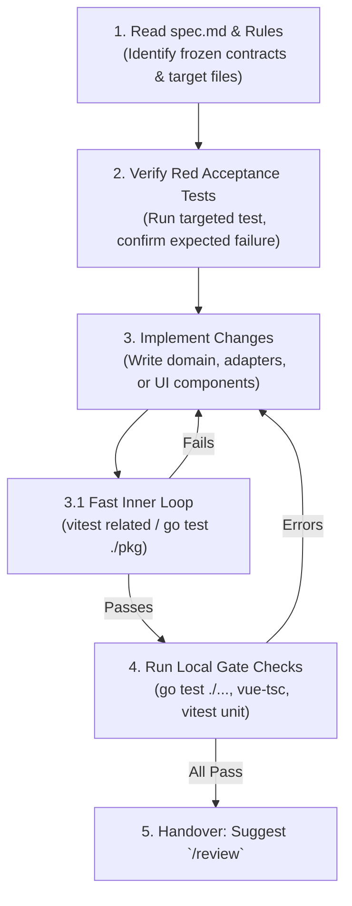

# Implementation Skill (`/coder`)

The `/coder` skill guides the implementation of features from a validated specification (`spec.md`) and acceptance tests into clean, green code following all repository rules.



---

## Core Rules for Implementation

1. **Never edit acceptance test files**: The acceptance tests are the independent verification contract. If a test is failing unexpectedly, find the bug in your code or ask the human.
2. **Frozen contracts**: Domain models, wire protocols, ports, and migrations are frozen. Do not alter them without human consent.
3. **Internal unit tests**: You may write narrow unit tests for your internal helper functions and unexported logic.
4. **Targeted testing first (Inner Loop)**: While iterating on code, run only tests related to the changed files (`vitest related` or `go test ./pkg`). Do not run blanket heavy suites or `-race` until final verification.
5. **Follow language rules**:
   - Backend (Go): [`.agents/rules/coding-style-backend.md`](../../rules/coding-style-backend.md)
   - Frontend (Vue/TS): [`.agents/rules/coding-style-frontend.md`](../../rules/coding-style-frontend.md)
   - Architecture & Layers: [`.agents/rules/architecture.md`](../../rules/architecture.md)
   - Comments & Docblocks: [`.agents/rules/comments.md`](../../rules/comments.md)

---

## Step-by-Step Execution

### Step 1: Read Spec & Verify Initial State
- Read `.agents/tasks/<slug>/spec.md` (or the task description).
- Verify the red acceptance tests exist and fail with expected errors using a targeted test runner.

### Step 2: Implement Code (Fast Inner Loop)
- Match the style of surrounding files.
- Place files on their correct architectural layer.
- Use imperative verb phrases for function names and predicate phrases (`is...`, `has...`) for booleans.
- **Fast feedback loop during edits:**
  - **Frontend:** `npx vitest related <changed-file>` or `npx vitest --changed`
  - **Backend:** `go test ./path/to/package` (or `go test -run TestName ./path/to/package`)

### Step 3: Run Local Validation Gates (Final check before handover)

From the touched module:

**Go modules (`modules/libs/core`, `modules/apps`):**
```bash
go vet ./...
go test ./...
go test ./container/...        # in modules/libs/core (architecture check)
```

**Frontend modules (`modules/apps/desktop/*`, `modules/libs/ui`):**
```bash
npx vue-tsc --noEmit
npx vitest run --project unit
```

*(Note: If touching `@numen/ui`, run `npm run build` in `modules/libs/ui` before running desktop window suites).*

---

## Step 4: Next Step Handover

Prompt the user clearly when all tests are green:

> 💻 **Implementation complete and verified.**  
> - All tests passing (green).  
> - Local typecheck and lint gates passed with exit 0.  
>  
> *Next step:* Run `/review` to execute the 3-stage code review pipeline (Gatekeeper $\rightarrow$ Bug Hunter $\rightarrow$ Adversary).
