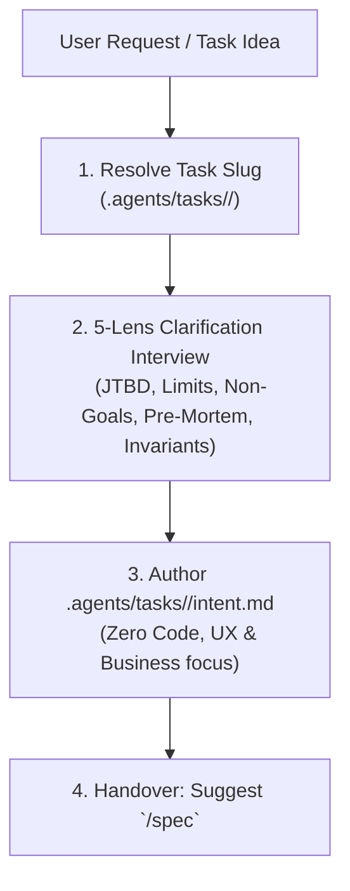

# Intent Skill (`/intent`)

The `/intent` skill defines the **human and business layer** of a task. It clarifies **why** the task is needed, **what** user or business problem it solves, **what** the expected interaction behavior is, and **what is strictly out of scope**.



---

## Strict Zero-Code Rule (Anti-Technical Pollution)

`/intent` MUST NEVER invent or record code-level implementation details:
- ❌ **No file names or extensions** (`.vue`, `.go`, `.ts`, `.sql`).
- ❌ **No database schema details** (tables, columns, foreign keys).
- ❌ **No code symbols or architecture terms** (DTO, interface, class, method, props, endpoint).
- ❌ **No HTTP methods or API routes** (`GET /...`, `POST /...`).
- ✅ **ONLY user journeys, business goals, UX workflows, limits, non-goals, and invariants.**

Technical decisions, interfaces, file mappings, and data structures belong exclusively to `/spec`.

---

## Step 1: Resolve Task Slug & Directory

1. Extract a clean, hyphenated slug from the user request (e.g. `feat-deck-export`, `fix-sync-conflict`).
2. Create the local task directory (ignored by git):
   ```bash
   mkdir -p ".agents/tasks/<slug>"
   ```

---

## Step 2: 5-Lens Clarification Protocol

Formulate concise questions covering the **5 essential lenses**:

| Lens | What to clarify |
| :--- | :--- |
| **🔍 1. JTBD & Core UX** | What specific problem does this solve for the user? What is the primary user interaction flow? |
| **🔍 2. Limits & Edge Cases** | What happens with large data, empty inputs, network interruptions, or boundary conditions? |
| **🔍 3. Strict Non-Goals** | Which related features, screens, or adjacent scopes are strictly OUT OF SCOPE? |
| **🔍 4. Pre-Mortem & Recovery** | What could fail when using this feature? How does the system recover or inform the user? |
| **🔍 5. Invariants** | What business rules, permissions, or security boundaries must never be violated? |

---

## Step 3: Author `.agents/tasks/<slug>/intent.md`

Generate `.agents/tasks/<slug>/intent.md` strictly reflecting the agreed answers:

```markdown
# Intent: <Title>

**Task Slug:** `<slug>`
**Date:** `<YYYY-MM-DD>`

## 1. Problem & JTBD (The "Why")
- **Pain & Trigger:** <User problem in plain language>
- **Target User & Scenario:** <Who uses this and when>
- **Desired Outcome:** <What the user observes upon success>

## 2. Scope Boundaries & Strict Non-Goals
### In Scope (Goals):
- <Clear user-facing capabilities, NO code/file names>
### Strictly Out of Scope (Non-Goals):
- <Explicitly excluded features/behaviors>

## 3. Limits & Failure Modes
| Scenario | Expected Behavior |
| :--- | :--- |
| Empty / Invalid Input | ... |
| Network / Transport Interruption | ... |
| Boundary Limit Exceeded | ... |

## 4. Invariants & Business Constraints
- Invariant 1: <Business / data integrity rule>
- Invariant 2: <Security / permission rule>
```

---

## Step 4: Next Step Handover

Prompt the user clearly with the next step:

> 🎯 **Intent locked in `.agents/tasks/<slug>/intent.md`.**  
> *Next step:* Run `/spec` to analyze the codebase, define interfaces, map blast radius, and generate acceptance criteria.
