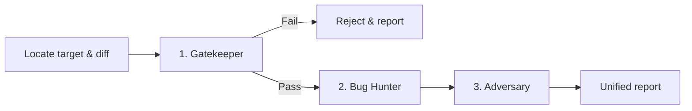

# Unified 3-Stage Code Review Pipeline (`/review`)

This skill orchestrates the sequential review pipeline for the numen repository. It locates the changed files, audits them against the decisions in `docs/adr/`, hunts for semantic defects across the blast radius, and proves or disproves each hypothesis with a test that runs.

One pipeline covers both sides of the product: the Go core and its adapters, and the Vue windows and the component library beneath them. The stage guides say what differs.



---

## Where the rules are

**The architecture is written down, not remembered.** Read `docs/adr/README.md`, then only the ADRs that relate to the paths in the diff. If a rule matters, it is in an ADR; if it is not in an ADR it is not yet a rule. When a change appears to contradict a decision, quote the ADR.

If a change is right and the ADR is wrong, say so. The finding is then "this contradicts ADR-NNNN, and the ADR looks outdated" — not silence.

`AGENTS.md` at the root and in the touched module carries the naming and placement conventions. They bind as the ADRs do. The distilled form lives in [`../../rules/`](../../rules/):

- [`rules/architecture.md`](../../rules/architecture.md) — the layout, the dependency arrows, determinism, one name per concept.
- [`rules/coding-style-backend.md`](../../rules/coding-style-backend.md) — Go.
- [`rules/coding-style-frontend.md`](../../rules/coding-style-frontend.md) — Vue and TypeScript.

**Length is never a finding.** A file is split when it holds a second responsibility. Do not report a line count, an import count, or a block size.

---

## Target & repository auto-detection protocol

Resolve the repository root and determine the target:

1. **Repository root**:
   ```bash
   REPO_ROOT=$(git rev-parse --show-toplevel 2>/dev/null || readlink -f .agents/.. 2>/dev/null || echo "$PWD/../source/numen")
   ```
2. **Explicit target**: a path (`/review modules/libs/ui/src/plex`) focuses the audit on those files; a git reference (`/review origin/main...HEAD`, a SHA) reviews that range.
3. **Auto-detection (default)**:
   - `git -C "$REPO_ROOT" status --short` and `git -C "$REPO_ROOT" diff HEAD`.
   - Dirty tree: audit the uncommitted diff.
   - Clean tree: take the branch delta.
     ```bash
     BASE=$(git -C "$REPO_ROOT" merge-base HEAD origin/main 2>/dev/null || git -C "$REPO_ROOT" merge-base HEAD main 2>/dev/null || echo "HEAD~1")
     git -C "$REPO_ROOT" diff $BASE...HEAD
     ```
   - State the detected target and the changed files before proceeding.

Every worktree of this repository shares one `git stash` stack. Never stash to get a clean tree — copy the file aside, or commit and `git checkout HEAD~1 -- <path>`.

---

## Sequential execution stages

### Stage 1: Gatekeeper & architectural audit
*Guide: [`stages/1-gatekeeper.md`](./stages/1-gatekeeper.md)*

1. **Automated gate** — `make lint` and `make test` from `REPO_ROOT`, with the library built before the windows' suites and the `modules/libs/ui` suites taken one at a time (the guide has the exact sequence; `make test` as written runs both story instances at once and dies before a test executes).
2. **Fail-fast** — a type error, a lint failure, a broken existing test, or a `-race` run that did not happen marks the gate **FAIL**. Stop and reject with the exact error output, unless told to continue.
3. **Architecture checklist** — dependency direction, ports and adapters, the `@numen/ui` domain boundary, the core/view split, tokens, naming, and one name per concept.

### Stage 2: Semantic logic & blast radius audit
*Guide: [`stages/2-bughunter.md`](./stages/2-bughunter.md)*

1. **Blast radius** — callers of every changed function, upstream sources of the state it reads, downstream watchers, renderers and subscribers.
2. **Defect matrix** — Go concurrency, context and cancellation, error paths, SQL and resources; Vue reactivity, lifecycle leaks, out-of-order responses; boundary and index errors; wire contracts across *A client is generated from the protocol*.
3. **Proof** — every defect carries a concrete scenario: *Given → When → Then*. No vague warnings.

### Stage 3: Dynamic stress verification
*Guide: [`stages/3-adversary.md`](./stages/3-adversary.md)*

1. **Attack vectors** — turn each hypothesis from Stage 2 into a test that should fail.
2. **Craft and run** — an adjacent `_test.go` or `.spec.ts`, executed. A failing test confirms the defect; a passing one confirms resilience and stays if it covers an edge nobody had covered.
3. **Mutation check** — for a test guarding a rule, break the rule and watch the test fail. A test that passes either way is worse than no test.

---

## Strict output formatting contract (mandatory)

1. **No intermediate chatter.** Output only the Unified Review Report.
2. **Deterministic sections** in this exact order with identical titles: `# 📋 Unified Code Review Report`, `## 🚦 Stage 1`, `## 🐞 Stage 2`, `## ⚔️ Stage 3`, `## 📝 Action Items`.
3. **No omitted sections.** Where there is nothing to report, use the placeholder line given below.

"No findings" is a real outcome and a useful one. Padding a review with cosmetic remarks to look thorough wastes the time of everyone who reads it.

---

## Standardized unified review report template

```markdown
# 📋 Unified Code Review Report

**Target**: `<branch / commit / file path>`
**Verdict**: `[ ✅ APPROVED | ⚠️ CHANGES REQUESTED | ❌ REJECTED ]`

---

## 🚦 Stage 1: Gatekeeper & Architecture

| Check | Status | Details |
| :--- | :---: | :--- |
| **gofmt / go vet** | `PASS / FAIL / N/A` | <details or '0 errors'> |
| **go test -race** | `PASS / FAIL / N/A` | <per module, or why it did not run> |
| **buf lint** | `PASS / FAIL / N/A` | <details or 'clean'> |
| **vue-tsc typecheck** | `PASS / FAIL / N/A` | <details or '0 errors'> |
| **Unit tests** (`vitest`) | `PASS / FAIL / N/A` | <details or 'X passed'> |
| **Story tests** (chromium / webkit) | `PASS / FAIL / N/A` | <both engines, or which one is missing> |
| **Architecture** (ADRs) | `PASS / FAIL` | <ADR numbers honoured or contradicted> |
| **Naming & placement** (`AGENTS.md`) | `PASS / FAIL` | <details or 'clean'> |

*Gatekeeper log:*
```text
<If failed: the exact error output.>
<If passed: every gate ran and exited 0; name the commands.>
```

---

## 🐞 Stage 2: Semantic Logic & Blast Radius

<!-- IF DEFECTS FOUND: one card per defect, ordered by what it costs -->
### [ CRITICAL | HIGH | MEDIUM ] <Defect title>
- **Location**: `path/file.go:L12-L34`
- **Category**: `[ Concurrency | Context | Reactivity | Boundary | Error Handling | Wire Contract | Architecture ]`
- **Failure scenario**:
  - **Given**: <initial state / preconditions>
  - **When**: <triggering action or event sequence>
  - **Then**: <failure, corrupted state, or crash>
- **Root cause**: <what is actually wrong>
- **Decision it contradicts**: <ADR-NNNN, or the Go / Vue rule, or none>
- **Direction**: <a direction, not a patch>

<!-- IF NO DEFECTS FOUND: output ONLY this line: -->
*No semantic logic defects or regressions detected.*

---

## ⚔️ Stage 3: Dynamic Stress Verification

| Attack vector | Target | Test file | Outcome |
| :--- | :--- | :--- | :---: |
| <attack description> | `<file.go>` | `<file_test.go or N/A>` | `[ 💥 BUG CONFIRMED / 🛡️ RESILIENT ]` |

*Failure details:*
```text
<assertion or failure trace, if a test failed>
```

<!-- IF RESILIENT / NO FAILURES: output ONLY this line: -->
*All targeted stress checks passed or the code is proven resilient.*

---

## 📝 Action Items & Recommendations

1. <Concrete action item>
<!-- IF APPROVED WITH NO ACTIONS: 1. None — the change is ready to merge. -->

<One line: what the change does, and whether anything in it blocks merging.>
```
