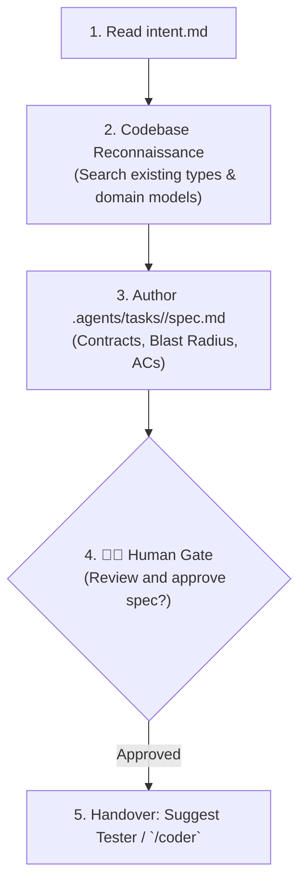

# Technical Specification Skill (`/spec`)

The `/spec` skill transforms business intent (`intent.md`) into a precise technical blueprint (`spec.md`). It maps existing code, prevents hallucinations, defines contracts, outlines the blast radius, and formulates acceptance criteria.



---

## Step 1: Locate Active Task and Read Intent

1. Identify the task directory from arguments or git branch:
   - Example: `.agents/tasks/<slug>`
2. Read `.agents/tasks/<slug>/intent.md`.
   - If `intent.md` does not exist, ask the user to run `/intent` first.

---

## Step 2: Codebase Reconnaissance (Anti-Hallucination Gate)

Before proposing new files, types, or methods, search the codebase:
1. Search existing domain models, ports, and DTOs across `modules/libs/core` and `modules/apps/desktop`.
2. Check existing composables, components, and utilities in `modules/libs/ui`.
3. Check relevant ADRs in `docs/adr/` governing the touched area.

---

## Step 3: Author `.agents/tasks/<slug>/spec.md`

Generate `.agents/tasks/<slug>/spec.md` with:

```markdown
# Specification: <Task Title>

**Task Slug:** `<slug>`
**Date:** `<YYYY-MM-DD>`
**Intent:** [.agents/tasks/<slug>/intent.md](intent.md)

## 1. Target Architecture & Interfaces
- Type signatures, interface definitions, or component prop/event contracts.
- Explicit placement: which layer each file belongs to (`shared`, `entities`, `features`, `widgets`, `pages`).

## 2. Blast Radius Matrix
| Package / Path | File | Action (Create/Modify) | Downstream Consumers |
| :--- | :--- | :--- | :--- |
| `modules/libs/core` | `domain/card.go` | Modify | `usecase/flashcards`, `adapter/sqlite` |
| `modules/apps/desktop/editor` | `src/features/deck/ui/DeckView.vue` | Create | `pages/DeckPage.vue` |

## 3. Negative Invariants (Architectural Prohibitions)
- Explicit architectural constraints (e.g. No direct DB access from UI, no god objects, preserve layer arrows).

## 4. Acceptance Criteria

### AC-1: <Title of Behavior 1>
- **Given**: <initial state / preconditions>
- **When**: <action or event triggered>
- **Then**: <expected observable outcome>

### AC-2: <Title of Behavior 2>
- **Given**: <initial state / preconditions>
- **When**: <action or event triggered>
- **Then**: <expected observable outcome>
```

> **Important on Test Naming**: Acceptance Criteria (AC-1, AC-2) are requirements tracking identifiers in `spec.md`. When converting them to code, tests must use **pure behavioral sentences** (e.g. `it('rejects card with empty front')` or `TestPush_RejectBehindAck`) — never prefix test functions with `AC-1` or synthetic tags.

---

## Step 4: Human Checkpoint & Next Step Handover

Present a concise summary of the specification to the user and request confirmation:

> 📐 **Specification created in `.agents/tasks/<slug>/spec.md`.**  
> - **Blast Radius:** `<N> files touched across <modules>`  
> - **Acceptance Criteria:** `<Count> verifiable behaviors defined`  
>  
> *Please review the specification above. Once approved, proceed to `/coder` (or let `tester` write the red acceptance tests).*
