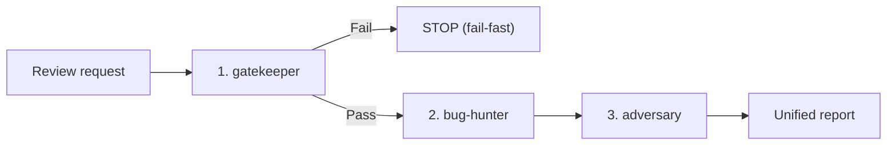

# Numen — Coding Conventions

These rules apply to all code in the numen repository. Every agent (Claude,
Gemini, or any other) must follow them.

## Canonical guides

- **Architecture decisions**: [`docs/adr/README.md`](../source/numen/docs/adr/README.md) — the rules live here, not in this file's memory.
- **Architecture guidelines**: [`.agents/rules/architecture.md`](.agents/rules/architecture.md)
- **Backend coding style (Go)**: [`.agents/rules/coding-style-backend.md`](.agents/rules/coding-style-backend.md)
- **Frontend coding style (Vue / TypeScript)**: [`.agents/rules/coding-style-frontend.md`](.agents/rules/coding-style-frontend.md)
- **Unified review skill (`/review`)**: [`.agents/skills/review/SKILL.md`](.agents/skills/review/SKILL.md)
- **Per-module conventions**: `AGENTS.md` inside `modules/libs/core`, `modules/libs/ui`, `modules/libs/protocol`, `modules/apps/desktop`.

## Code review protocol: the 3-stage pipeline (`/review`)

When asked to review code or a pull request, run the pipeline in
[`.agents/skills/review/SKILL.md`](.agents/skills/review/SKILL.md):



1. **Gatekeeper & architecture** — [`stages/1-gatekeeper.md`](.agents/skills/review/stages/1-gatekeeper.md): module targets for touched packages (e.g. `make lib_core_lint lib_core_test`, `make lib_ui_lint lib_ui_test`), then the diff against the ADRs. A failing gate stops the pipeline.
2. **Semantic logic audit** — [`stages/2-bughunter.md`](.agents/skills/review/stages/2-bughunter.md): the blast radius, and every defect proven with *Given → When → Then*.
3. **Dynamic stress verification** — [`stages/3-adversary.md`](.agents/skills/review/stages/3-adversary.md): a test that forces the failure, and the mutation check on the change's own tests.
4. **Synthesis** — the Unified Review Report exactly as templated in the skill.

One pipeline covers Go and Vue. A reviewer reports findings and does not fix
them.

---

## 1. Comments state the rule, and stop

A comment says what holds. It never names an alternative that is not in the
code, and never cites an ADR number — restate the rule inline instead.

Before writing a comment, delete each clause in turn. If what remains still
describes the code, the deleted clause was argument and does not belong.

Rewrite on sight of any of these:

- `rather than X`, `instead of X`, `not X but Y`
- `X would have…`, `otherwise somebody would…`, `told only Y, a caller would…`
- `so that we do not…`, `to avoid…`
- `these are those X`, `which is why this exists`
- benchmark numbers, or any comparison with a previous implementation
  (measurements live only in `docs/performance.md`)

Two sentences is usually the ceiling. The same holds in ADRs: a passage that
would read as true with nothing decided is narration.

---

## 2. Function and method naming (all languages)

Functions and methods take **imperative verb phrases** in the base form
(`get…`, `read…`, `write…`, `fetch…`, `create…`, `open…`, `delete…`) or
**predicate phrases** (`is…`, `has…`, `can…`).

Forbidden patterns:

| Pattern | Example | Fix |
|---|---|---|
| Third-person singular | `carries`, `attends`, `reads` | `carry`, `attend`, `read` |
| Past participle | `listened`, `spoken`, `cued` | `getTranscript`, `transcribe` |
| Bare noun / adjective | `highlight`, `book` | `getHighlight`, `createBook` |
| Literary metaphor | `minting`, `held`, `cold` | `getTitle`, `getActiveTab`, `getTitle` |

A method states **what operation is performed** using standard engineering
terms, never literary third-person narrative.

---

## 3. Event handler naming (frontend — TypeScript / Vue)

Event handlers are named `on<Action>`:

```ts
// ✅ correct
onSubmit, onClose, onClick, onSelect, onToggle

// ❌ wrong
cold, submitted, handle, doThing
```

In Vue `<template>`, emits use kebab-case (`@item-selected`); the
corresponding handler in `<script>` is `onItemSelected`.

---

## 4. Vue component structure (`<script setup>` / `<script>`)

All Vue components organize their `<script>` block into sections separated by
80-character comment banners:

```vue
<script setup lang="ts">
/* --------------------------------- Props ---------------------------------- */
const props = defineProps<{ ... }>()

/* --------------------------------- Events --------------------------------- */
const emit = defineEmits<{ ... }>()

// Or when combined:
/* ----------------------------- Props & Emits ------------------------------ */

/* --------------------------------- State ---------------------------------- */
const isOpen = ref(false)
const title = computed(() => ...)

/* --------------------------------- Hooks ---------------------------------- */
onMounted(() => { ... })

/* -------------------------------- Handlers -------------------------------- */
function onSubmit() { ... }
function onClose() { ... }

/* -------------------------------- Helpers --------------------------------- */
function formatValue(val: string) { ... }
</script>
```

Rules:
1. Always follow the order: **Props → Events (or Props & Emits) → State → Hooks → Handlers → Helpers**.
2. Only include headers for sections that actually exist in the component.
3. The banner is the 80-character form: `/* --------------------------------- <Name> ---------------------------------- */`.
4. A section with independent state, or a part rendered on its own elsewhere, is extracted into its own component.
5. Business logic does not live in a `.vue` file — it is a composable or a domain model.

The components in the tree still carry the short `// --- <Name> ---` form. They
are migrated to the banner above; until that lands, the banner is what new and
touched components take.

---

## 5. Composables naming (`use<Feature>`)

Composables and reactive state factories in Vue must be named with the `use…` prefix:

```ts
// ✅ correct
useBookTab, useDocumentTab, useAgentChat, useFileManager

// ❌ wrong (gerunds, verbs, literary words)
booking, documenting, talking, opening
```

---

## 6. Type and interface naming (all languages)

Types and interfaces are **singular nouns** or noun phrases:

```ts
// ✅
Tab, FileEntry, MoveResult, TranscriptSegment

// ❌ gerunds, adjectives, verbs
Opening, Doing, Failed
```

### Boolean fields

Boolean fields and properties use `is…` / `has…` / `can…` prefix:

```ts
// ✅
isUserRequested: boolean
hasTranscript: boolean

// ❌
userRequested: boolean   // reads as past tense, not boolean
failed: string           // "failed" looks boolean but is a string — rename to failureReason
```

### Struct / interface fields

Fields are **noun phrases** that say what they hold:

```ts
// ✅
title, completedCount, totalCount, failureReason, progressPercent

// ❌ cryptic or ambiguous
about, doing, done, total, counting
```

---

## 7. Factory and constructor functions

### Frontend (TypeScript / Vue)

Factory functions use `create…`:

```ts
// ✅
createTab, createBookKind, createDocumentTab

// ❌
makeTab, bookKind, newTab
```

The word `make` is **not used** in frontend code for factories.

### Go

Go follows its own idioms: `New…` for constructors, `make` for built-in
allocation. Both are allowed.

```go
// ✅
NewServer(), NewReading(), make(map[string]string)
```

---

## 8. Result pattern for fallible operations (frontend)

Functions that can fail return a **discriminated result**, never a bare value,
implicit `null`, or custom `refusal`:

```ts
type Result<T, E = ErrorCode> = { ok: true; value: T } | { ok: false; error: E }

// ✅
function openVault(id: string): Result<Vault, ErrorCode>

// ❌ caller cannot tell success from failure, or uses custom discriminant
function openVault(id: string): Vault | ErrorCode | undefined
function openVault(id: string): { ok: boolean; refusal?: RefusalReason }
```

Pick **one** word for the failure discriminant: **`error`** (never `refusal`, `reason`, or `refusalReason`).

---

## 9. Domain terminology

Use the **project glossary** (`docs/glossary.md`) as the single source of
truth for domain terms. When the glossary and code disagree, fix the code.

Specific term rules:

| Wrong | Correct | Context |
|---|---|---|
| `refusal`, `refused` | `error`, `errorCode` | operation error discriminants |
| `readings` | `recognition` | OCR output — the core's word is `Recognition` |
| `spoken`, `spokenBy` | `transcript` | audio/video transcription output |
| `reflow` for EPUB | `book` | EPUB = book; PDF = document |
| `make` (frontend) | `create` | factory functions in TS/Vue |

Three words this table used to call wrong are the glossary's own, and renaming
them breaks ADR-0026 rather than serving it:

- **`stretch`** is a run of a source's text where it stands, in bytes. **`span`**
  is that same run as a client counts it, `from` and `to` in UTF-16 code units.
  Both are correct, on their own side of the boundary, and ADR-0026 lists the
  pair as a rename the boundary requires. A third name for either is the defect.
- **`address`** is scheme and value, the only thing that says where a link goes.
  **`link`** is the relationship as written in a file. Collapsing the two makes
  the homonym ADR-0026 forbids.
- **`overtaken`** is the glossary's word for a tab whose file no longer holds
  the prose the tab read. `stale` appears nowhere in the glossary.

The glossary itself must contain **only project-specific terms** — terms that
have a meaning in this project different from or more specific than their
general meaning. Obvious industry terms (tree, drag, chunk, window, theme) do not belong.

---

## 10. File placement — domain code stays in its domain

Code that serves one domain lives inside that domain's folder under
`modules/apps/desktop/ui/src/`:

| File | Belongs in |
|---|---|
| Note-specific types (`Move`, `Focus`, `Enabler`) | `note/` |
| File-manager entries (`FileEntry`, `MoveResult`) | `files/` |
| Flashcard review settings | `cards/` |

There is no `tabs/` folder and no `shared/`. What two or more domains genuinely
use sits at the top of `src/` under the word for what it is — `transport.ts`,
`theme.ts`, `words.ts` — and a type only one domain reads never moves there.

---

## 11. Single Responsibility — no god objects

Do not build a single type or composable that handles all variants of a
concept. Split by capability:

```ts
// ❌ one ArtifactRunner that can transcribe, correct, fetch for all artifact types
class ArtifactRunner { transcribe(); correct(); fetch(); }

// ✅ separate by capability, composed via generics or mixins
interface Transcribable { getTranscript(): Transcript }
interface Correctable  { applyCorrection(c: Correction): void }
```

A file is split when it holds a second responsibility. The unit of organisation
is the thing, not the kind of thing: a folder collecting every type, every
handler or every use case is a heap at fifty entries and was already one at
five.

## 12. File and directory naming (frontend — TypeScript / Vue)

Directories and files follow strict casing rules:

1. **Directories**: always `kebab-case` (`status-corner/`, `command-palette/`, `file-routing/`, `tabs/`).
2. **Vue components**: always `PascalCase` (`App.vue`, `NoteTab.vue`, `Field.vue`).
3. **TypeScript / JavaScript files**: always `camelCase` (`useWorkspaceTabs.ts`, `useFileRouter.ts`, `transport.ts`, `words.ts`, `answers.ts`).

---

## 13. Known gotchas

- **Every worktree shares one `git stash` stack.** Two agents stashing at once
  cross: one `pop` takes the other's entry into the wrong tree. For a clean
  tree, commit first and `git checkout HEAD~1 -- <path>`, or copy the file
  aside.
- **The windows reach `@numen/ui` through its build.** Run `npm run build` in
  `modules/libs/ui` before the suites in `modules/apps/desktop/ui` and
  `flashcards`, or they fail on `Cannot find module '@numen/ui'`.
- **`node_modules` symlinked from the primary checkout resolves
  `@numen/protocol` to whatever branch that checkout is parked on.** A
  generated symbol missing there is that, not the branch under test. Install
  for real when the answer matters.
- **`usecase/flashcards` and `adapter/flashcardsui` run close to the 10-minute
  per-package limit under `-race`.** A timeout there is the machine's load, not
  the code.
- **`npm test` in `modules/libs/ui` starts both story instances at once**, and
  the run dies before any test executes. Take them one at a time:
  `npm run test:unit`,
  `vitest run --project 'stories (chromium)'`,
  `vitest run --project 'stories (webkit)'`. WebKit does run on this machine.
