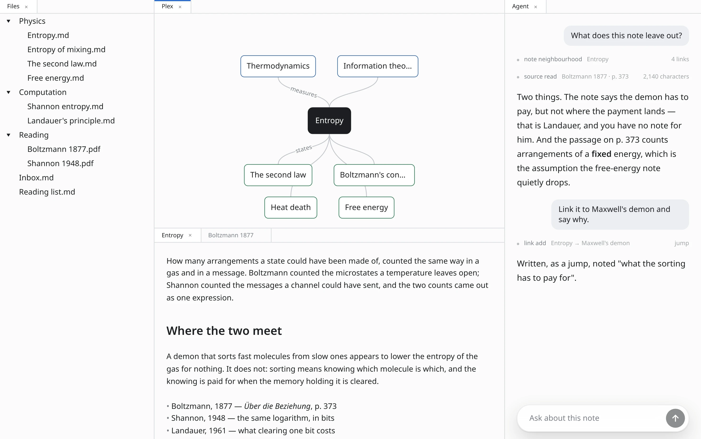

# Numen

**A private, local-first workspace for notes, sources, and memory.**

[Website](https://numen.md) · [Downloads](#downloads) · [User Manual](https://docs.numen.md) · [Community Forum](https://forum.numen.md)

 

Numen brings your writing, reference library, and spaced repetition into a single desktop application that runs entirely offline.

## Features

### Local Markdown storage
Notes are standard Markdown files stored in folders on your local disk. Edit them in any text editor, track them with Git, or inspect them with command-line tools.

### Connected notes and the Plex
Notes connect through typed semantic relationships and multiple parent contexts. The Plex view visualizes the connections surrounding your active note, updating links automatically when files are renamed or moved.

### Audio recordings and PDFs
Import recordings and PDF documents directly into your vault. In-process models transcribe spoken speech and perform document OCR, allowing search to navigate directly to audio timestamps and highlighted text on pages.

### Spaced repetition
Create flashcard decks using Markdown headings directly inside your notes. Review cards with the modern FSRS scheduling algorithm in a dedicated, distraction-free companion window.

### Local AI assistant
Query your vault, discover connections, and draft flashcards using an optional assistant that operates through local tools without transmitting data over the network.

## Downloads

Numen is available as a native desktop application for macOS, Windows, and Linux.

| Platform | Format | Direct Download |
|:---|:---|:---|
| **macOS** | Universal (`Apple Silicon` & `Intel`) | [numen-macos.dmg](https://dl.numen.md/latest/numen-macos.dmg) |
| **Windows** | Installer (`x64`) | [numen-windows-setup.exe](https://dl.numen.md/latest/numen-windows-setup.exe) |
| **Windows** | Portable (`x64 · zip`) | [numen-windows-amd64.zip](https://dl.numen.md/latest/numen-windows-amd64.zip) |
| **Linux** | Debian / Ubuntu (`.deb`) | [numen-linux-amd64.deb](https://dl.numen.md/latest/numen-linux-amd64.deb) |
| **Linux** | Fedora / RHEL (`.rpm`) | [numen-linux-amd64.rpm](https://dl.numen.md/latest/numen-linux-amd64.rpm) |
| **Linux** | Flatpak | [numen-linux-amd64.flatpak](https://dl.numen.md/latest/numen-linux-amd64.flatpak) |
| **Linux** | Standalone Tarball (`.tar.gz`) | [numen-linux-amd64.tar.gz](https://dl.numen.md/latest/numen-linux-amd64.tar.gz) |

## Resources

- [User Manual](https://docs.numen.md) — Guides on vault setup, syntax, and card scheduling.
- [Community Forum](https://forum.numen.md) — Workflows, discussions, and feature requests.
- [GitHub Repository](https://github.com/jiva-studio/numen) — Source code, issue reports, and roadmap.

## License

Numen is open-source software licensed under the [GNU Affero General Public License v3.0 (AGPL-3.0)](LICENSE).
