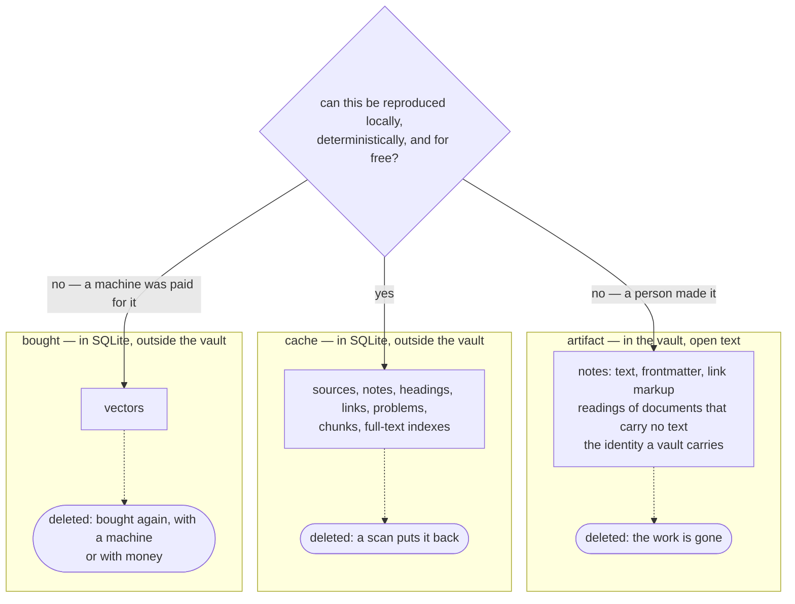

# Files on disk are the source of truth

- **Status:** Accepted
- **Date:** 2026-08-25
- **Applies to:** the product — every application in this repository
- **Related:** [One database for all vaults, outside them](0002-one-database-for-all-vaults.md), [A vault is scanned in the background](0008-a-vault-is-scanned-in-the-background.md), [The vault is watched](0009-the-vault-is-watched.md), [Text is cut twice](0011-text-is-cut-twice.md), [A chunk is identified by its text](0012-a-chunk-is-identified-by-its-text.md), [A book's text is a cache or an artifact](0015-a-books-text-is-a-cache-or-an-artifact.md), [The application writes to the vault](0017-the-application-writes-to-the-vault.md), [The note file](0018-the-note-file.md)

## Context

A tool of this shape accumulates many kinds of data: note text, link markup, a link table, a full-text index, headings, chunks, a reading of a scanned page, vectors. Each of them has to be somewhere, and one rule answers for the ones nobody has thought of yet. This is a tool people put years into, so the rule starts from what is left of their work when the application is gone.

## Decision

### The vault is an ordinary directory of ordinary files

Notes are `.md` files with YAML frontmatter, in whatever folder structure the person likes, and the application neither imposes nor rearranges that layout. The link markup lives in the note file — see [the note format](../note-format.md). The application stores nothing unique in its own database, and deleting the index in full loses nothing.

Third-party tools therefore work on live data: `rg`, `git`, vim, another markdown editor, a sync client, the person's own scripts, with the application closed. What that costs is a watcher, a scan that reads a moving vault, rows that outlive the files they describe, and a write path that puts a file back whole.

### Three classes, and one question that sorts them

> **Can this be reproduced locally, deterministically, and for free?**

- **Yes → it is a cache.** It lives in SQLite, outside the vault, and deleting it costs a scan.
- **No, a person made it → it is an artifact.** It lives in the vault, in an open text format.
- **No, a machine was paid for it → it is bought.** A vector is bought: minutes of a machine, or money and a network.

"For free" means without a network call, without a paid service, and without a model whose output is not byte-reproducible. "Deterministically" means the same input gives the same output on any machine, on any day.

### A vector is kept, and dropped at one moment

A vector lives in SQLite beside the cache and is kept. It is addressed by the text it was made from and the recipe it was made under — where a model runs, its width, where the text was cut off, how its output becomes one vector, how the numbers are stored. It is dropped when a source is cut again and the text the vector was made from is held by no chunk, and by a numbered migration that empties the table. Nothing else deletes one.

### Anything producing artifacts rebuilds its cache from them

Whatever writes an artifact into a vault can rebuild every cache derived from that artifact out of the vault alone, offline. The text a reading takes out of a document that carries none is an artifact for this reason.

## Consequences

- A cold rebuild reads every file in every vault, and has to report progress and stay usable while it runs.
- Rows outlive the files they describe, and startup has to find them.
- Storing something new starts by answering the question above, and "artifact" means writing a file format.
- A vector survives a rebuild of the cache, and the recipe it was made under is stored beside it.
- "You are not locked in" is checkable, with the application closed.

## Alternatives considered

**A database as the source of truth, with files exported on demand.** Rejected: it kills what motivates the design — other tools operating on live data.

**Files as the source of truth, editable only while the application is closed.** Rejected: lock-in through the back door, and nothing enforces it.

**Two classes, kept and rebuildable.** Rejected: a vector is rebuildable in the sense the code cares about and not in the sense the person's bill cares about, and one word covering both is the word that throws a vector away.
