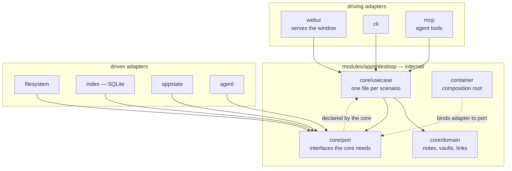

# ADR-0004: A hexagonal core in Go

- **Status:** Accepted
- **Date:** 2026-08-25
- **Applies to:** `modules/apps/desktop`
- **Related:** ADR-0001, ADR-0002, ADR-0005, ADR-0006, ADR-0020, ADR-0021,
  ADR-0023, ADR-0025

## Context

The core decides what is true about a vault. A window, a command line and an
agent each need to reach it. The shape of the code is settled once, because
every later file is written inside the answer.

## Decision

### The architecture has names, and they are these

The application is **hexagonal architecture**: the domain declares ports, and
adapters implement them. It follows the dependency rule of **clean
architecture**: imports point inward only, and nothing under `internal/core`
imports an adapter. It is organised by the tactical patterns of **domain-driven
design**: aggregates, repositories, queries, and use cases named after the
scenario, in the ubiquitous language of ADR-0026.

What a client says to the core is ADR-0005.



### One binary; the core is a package, not a process

The core is compiled into whatever runs it. There is no background daemon.

The window serves the generated handler in-process and the tool endpoint on a
loopback port; both are adapters inside the same binary.

### The domain knows nothing that has a lifetime

The domain holds notes, vaults, the index model and the rules over them. It may
not know that files exist, that SQLite exists, or what time it is. A filesystem,
a database, a clock and an agent are each a port the core declares and an adapter
that implements it.

Ports are declared in `core/port`, because the core is what needs them. Adapters
never name the interface they satisfy. Ports are named after the need, adapters
after the technology: the core asks for a `VaultReader`, and that the answer is a
filesystem is knowledge confined to `adapter/` and `container/`.

Entry points are adapters. The command line, the window and the tool endpoint are
three of them, and the core knows about none.

### A Go module per application

Each application carries its own `go.mod` beside its code. There is no module at
the repository root. `modules/libs/` holds what more than one application is
generated from or draws with: the protocol and the interface library.

### Layout inside an application

```
modules/apps/<app>/
  go.mod
  cmd/<binary>/             entry point and the process's own concerns
  internal/
    core/
      domain/                one file per type: vault.go, note.go, link.go
      port/                  one file per port: vault_reader.go, note_queries.go
      usecase/<aggregate>/   one file per scenario: add.go, scan.go, rename.go
      markdown/              the note format, parsed
    ulid/                    identifiers
    testsupport/             fixtures and generated vaults, for tests only
    adapter/
      cli/                   driving: arguments in, text out
      webui/                 driving: the window's handler
      mcp/                   driving: tools an agent calls
      filesystem/            driven: a vault on disk
      index/                 driven: the cache, a folder per aggregate
        <aggregate>/         repository.go, queries.go, sql/*.sql
        migration/           numbered schema changes
      appstate/              driven: the registry and settings
    container/               composition root: adapter to port
```

The unit of organisation is the thing, not the kind of thing. An aggregate is a
folder holding its repository, its queries and its SQL together; a use case is a
file named after the scenario.

A repository is a collection of aggregates: put one in, take one out, remove one.
Anything answering across many of them, in a shape that is not an aggregate, is a
query and lives beside the repository.

`internal/` is enforced by the compiler, so the boundary is a fact, and the
layers need not be separate modules to stay separate.

### SQL lives in files

Schema and queries are `.sql` files embedded into the binary, one statement per
file, loaded by name.

### The SQLite driver is pure Go, behind the index port

`modernc.org/sqlite`, so a desktop application builds for macOS, Windows and
Linux from one machine. It carries the vector extension. It lives behind the
index port, so replacing it is one adapter.

## Consequences

- The parts most likely to change — driver, storage, entry point — are each one
  adapter.
- Ports and adapters are indirection, and it is visible before the payoff is.
- A module per application means a dependency shared by two of them is declared
  twice until it is worth extracting.

## Alternatives considered

**A daemon with the clients as thin front ends.** Rejected: independent
lifecycles buy nothing here, and the boundary being crossed is between two
languages rather than two machines.

**One module for the whole repository.** Rejected: the repository holds several
applications, and a manifest at the root would make the root a project it is
not.

**`mattn/go-sqlite3`.** Deferred: cgo turns cross-compilation into a build
matrix, and that cost lands on every release.
