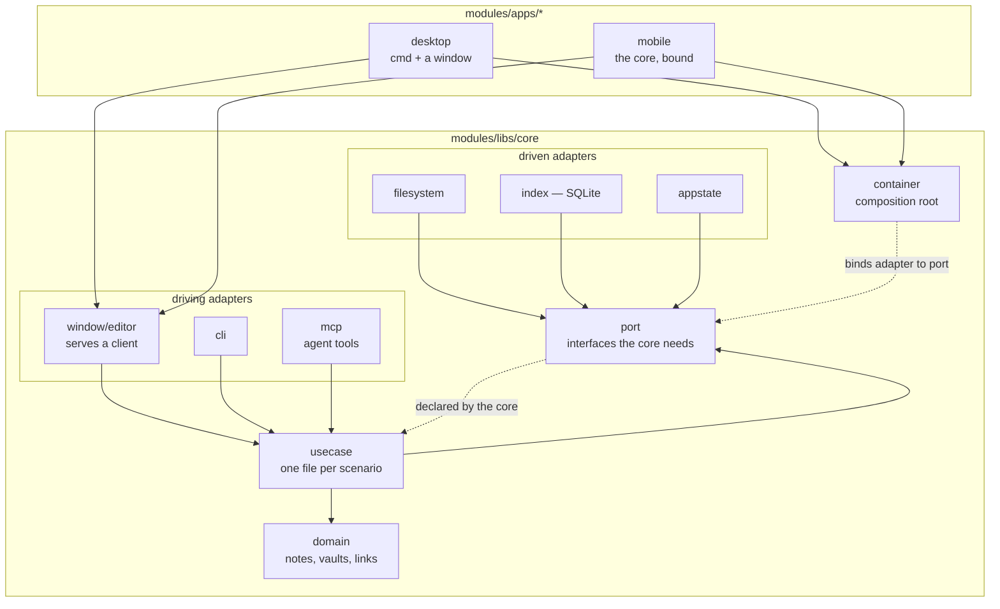

# A hexagonal core in Go

- **Status:** Accepted
- **Date:** 2026-08-25
- **Applies to:** `modules/libs/core`, `modules/apps/desktop`, `modules/apps/mobile`
- **Related:** [Files on disk are the source of truth](0001-files-are-the-source-of-truth.md), [One database for all vaults, outside them](0002-one-database-for-all-vaults.md), [A client is generated from the protocol](0005-a-client-is-generated-from-the-protocol.md), [What the index stores](0006-what-the-index-stores.md), [One process, one lifetime](0020-one-process-one-lifetime.md), [An agent reaches the vault through tools](0021-an-agent-reaches-the-vault-through-tools.md), [How an interface component is built](0023-how-an-interface-component-is-built.md), [How this application is tested](0025-how-this-application-is-tested.md)

## Context

The core decides what is true about a vault. A window, a phone, a command line and an agent each need to reach it. The shape of the code is settled once, because every later file is written inside the answer.

## Decision

### The architecture has names, and they are these

The application is **hexagonal architecture**: the domain declares ports, and adapters implement them. It follows the dependency rule of **clean architecture**: imports point inward only, and nothing under the core's own packages imports an adapter. It is organised by the tactical patterns of **domain-driven design**: aggregates, repositories, queries, and use cases named after the scenario, in the ubiquitous language the [glossary](../glossary.md) holds.

What a client says to the core is the protocol, and every client is generated from it.



### One binary; the core is a package, not a process

The core is compiled into whatever runs it. There is no background daemon.

An application serves the generated handler and the tool endpoint itself; both are adapters inside the same binary. The desktop window reaches the handler in-process through a custom scheme, and the phone reaches it over a loopback socket, because a `WebView` there has no other way in.

### The domain knows nothing that has a lifetime

The domain holds notes, vaults, the index model and the rules over them. It may not know that files exist, that SQLite exists, or what time it is. A filesystem, a database, a clock and an agent are each a port the core declares and an adapter that implements it.

A port an adapter is bound to in `container` is declared in `port`, because that is where the composition root looks for it. A one-method interface a single use case needs is declared beside that use case, where its only consumer can see it whole. Adapters never name the interface they satisfy. Ports are named after the need, adapters after the technology: the core asks for a `VaultReader`, and that the answer is a filesystem is knowledge confined to `adapter/` and `container/`.

Entry points are adapters. The command line, the window and the tool endpoint are three of them, and the core knows about none.

### A module for the core, a module for each application

The core is a Go module, and each application is another beside its own code. There is no module at the repository root. `modules/libs/` holds what an application imports or is generated from: the core, the protocol and the interface library.

An application names a configuration, mounts the driving adapters it serves, and runs. Its manifest declares what it starts and nothing else: the desktop's names a window toolkit and the core.

### An implementation only one application can start lives in that application

An adapter behind a port is the core's when every application can run it, and the application's when one can. The agent behind `port.Agent` starts a program on the machine, so it sits in the desktop application; a phone binds that port to nothing and the panel says there is no agent.

### Layout

```
modules/libs/core/
  go.mod
  domain/                  one file per type: vault.go, note.go, link.go
  port/                    one file per port: vault_reader.go, note_queries.go
  usecase/<aggregate>/     one file per scenario: add.go, scan.go, rename.go
  container/               composition root: adapter to port

  markdown/                the note format, parsed
  flashcards/format/       what a card is written in
  flashcards/review/       how a card is scheduled
  chunking/  embedding/    text into chunks, chunks into vectors
  epub/  ocr/  highlight/  a book's text, and where it falls on a page
  transcript/  proofread/  a recording's words, and putting them right
  text/  task/  check/     read a source, follow a run, report a vault's faults
  fixes/                   a correction kept
  appearance/              the window's own surface

  adapter/
    cli/                   driving: arguments in, text out
    mcp/                   driving: tools an agent calls
    index/                 driven: the cache, a folder per aggregate
      <aggregate>/         repository.go, queries.go, sql/*.sql
      migration/           numbered schema changes
    settings/              driven: what a person configured
    agent/                 driven: which agent answers
    window/                one adapter to a window
      editor/              driving: the handler the notes window asks
      flashcards/          driving: the handler the review window asks
  internal/
    adapter/               driving or driven: what nothing outside composes
      filesystem/          driven: a vault on disk
    onnxruntime/           the runtime two driven adapters run models through
    ulid/  cardid/         identifiers, and the ones a card is known by
    wire/                  what two driving adapters both put on the wire
    testsupport/           fixtures and generated vaults, for tests only

modules/apps/<app>/
  go.mod
  cmd/<binary>/            entry point and the process's own concerns
  internal/adapter/        what this application alone can start
```

The unit of organisation is the thing, not the kind of thing. An aggregate is a folder holding its repository, its queries and its SQL together; a use case is a file named after the scenario.

A repository is a collection of aggregates: put one in, take one out, remove one. Anything answering across many of them, in a shape that is not an aggregate, is a query and lives beside the repository.

### `internal/` marks what nothing outside composes

An application reaches the core's own language, the driving adapters it serves, and `container`. An adapter it does not name sits under `internal/`, where the compiler holds it, so binding an adapter to a port stays one package's work.

`internal/` is Go's visibility, and it says who may compose a thing — never which way a call goes through it. A driving adapter nothing outside composes belongs there as much as a driven one: `internal/adapter/theme` serves the schema and is mounted by two windows, and an application still reaches it through `container` rather than by naming it.

### Infrastructure two adapters share sits beside them

What two adapters both run on and neither owns — the ONNX Runtime a recognition and a transcription both load their models through — is its own package under `internal/`, outside `adapter/`. An adapter is given what it needs and reaches no other adapter, and that rule is what keeps the shared thing a package of its own.

### The core has no logger

The core writes to no stream of its own. What went wrong in work it carries on past — a watcher that lost the folder it was following, a queue that could not read a file — is said through `port.Trouble`, and an installation that binds none is told nothing. What a call could not answer is that call's error, and goes back to whoever asked.

### SQL lives in files

Schema and queries are `.sql` files embedded into the binary and loaded by name. A query is one statement to a file. A migration is a sequence, and it is the one file that holds more than one.

### The SQLite driver is pure Go, behind the index port

`modernc.org/sqlite`, so a desktop application builds for macOS, Windows and Linux from one machine, and a phone carries the same code. It carries the vector extension. It lives behind the index port, so replacing it is one adapter.

## Consequences

- The parts most likely to change — driver, storage, entry point — are each one adapter.
- Ports and adapters are indirection, and it is visible before the payoff is.
- An application declares what it starts and nothing else, and a dependency two of them share is declared once.
- An adapter an application composes is public, and the list of them is the core's surface to keep small.

## Alternatives considered

**A daemon with the clients as thin front ends.** Rejected: independent lifecycles buy nothing here, and the boundary being crossed is between two languages rather than two machines.

**One module for the whole repository.** Rejected: the repository holds several applications, and a manifest at the root would make the root a project it is not.

**The core inside the desktop application, imported from nowhere else.** Rejected: `internal/` is not importable across modules, so a second application reaches the core only by living inside the first.

**`mattn/go-sqlite3`.** Deferred: cgo turns cross-compilation into a build matrix, and that cost lands on every release.
