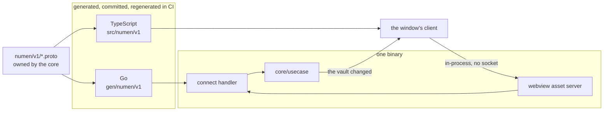

# A client is generated from the protocol

- **Status:** Accepted
- **Date:** 2026-08-25
- **Applies to:** `modules/libs/protocol`, `modules/apps/desktop`, `modules/libs/wire`
- **Related:** [A hexagonal core in Go](0004-a-hexagonal-core-in-go.md), [The vault is watched](0009-the-vault-is-watched.md), [How an interface component is built](0023-how-an-interface-component-is-built.md), [One service to a subject](0034-one-service-to-a-subject.md)

## Context

The window is a webview, so a client is written in another language from the core. There is more than one: the editor, the review window and the phone are three, and a web client reaching a core that runs elsewhere is a plausible fourth. They differ in how far the message travels.

## Decision

### The contract belongs to the core

The protocol under `modules/libs/protocol` describes what can be asked and what comes back. Every client is generated from it and the core answers it. A client consumes the contract and never authors one. Which service a question is asked of follows from its subject: one service to a subject.

### The Go types and the TypeScript types are both generated

Neither side hand-writes a type the schema already describes, so a field renamed on one side fails a build.

### What travels is what a client asks and is answered

The schema carries questions and their answers. It is not a second model of the vault. What the person wrote and what the application worked out do not arrive looking alike.

### A status code says the call could not be answered; an error code is an answer

A status code is for a call that did not happen: nothing serves it, the window is going, the request is not a request. **An error code is a successful call whose answer is no** — a name taken, a file that moved past the caller, a vault the list does not hold — and it rides in the response as a value of a closed enum, with the field that would have carried the answer absent.

A client that must read a status code to tell one outcome from the other has two paths to one answer, and the one it takes depends on what the transport did on the way.

### Only bytes stay on HTTP

A file's own bytes are served over HTTP, because that is what a browser's own elements speak: a page drawn from a document, the range of a recording a player asks for, the interface itself. Everything else is a message on a service, whatever else it might have been modelled as a resource. A question answered in JSON at a path of its own is a second contract with nothing generated from it and nothing linting it.

### The transport is the client's business

The generated handler is given to the webview's own asset server, and requests are answered in-process with no socket opened. A client that runs elsewhere changes where the bytes go and nothing else.

### A change is pushed

A client is told when the vault changes, over a stream the schema declares. It does not ask on a timer.

### The schema is checked where it can fail

Lint on every change, a breaking-change check against the branch being merged into, and the generated output committed and regenerated in CI, so a schema and its output cannot disagree in a merge.

### Where the lint and Google's guidance disagree, the lint wins

Buf's standard rules want a request and a response message of its own for every call, named after the call. Google's API guidance wants a read to answer with the resource itself and no wrapper around it. The two cannot both be followed, and this schema follows the lint: a rule a machine checks on every change is worth more here than one a reader has to remember, and the wrapper is what lets a call answer an error code beside the thing that was asked for.

### No field changes name at this boundary

A field carries the name it has in the core across the wire. A stretch and a span are not an exception to that: they are two things, they keep their own names on both sides, and the wire carries each under the name it has.

A type's own name is another matter, because a proto package is one flat namespace where the core has packages that qualify a name for it. Two enums are where this bites — the theme's way of choosing light or dark, and the search's mode — and the second of them carries its subject in front of it on the wire. The field is named the same on both sides of both.

The search's modes are the one place a name is chosen twice over: the wire spells the question as a person asks it, and the core spells the retrieval technique it runs. Every name that changes on the way across is written down where a reader meets it: beside the enum in the schema, and in [the glossary](../glossary.md).

## Consequences

- A further client inherits the contract.
- The two languages disagree at build time, in one place, by name.
- Moving a client out of the binary is a transport change.
- The toolchain grows two generators, and a build that skips them is a build against yesterday's contract.
- Every call carries two messages of its own, and a read that answers one thing answers it inside a wrapper.
- `modules/libs/protocol` has seven consumers — three Go modules and four npm packages — and a change to it is built against all of them.

## Alternatives considered

**The webview toolkit's own bindings.** Rejected: they expose Go methods directly, so the contract is whatever the exported methods happen to be that day, with nothing to lint, nothing to check for breaking changes, and nothing a second client could be generated from.

**Hand-written messages over the same handler.** Rejected: the two sides drift, and the first anyone hears of it is an empty field in the interface.
