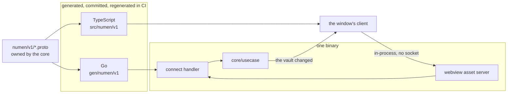

# ADR-0005: A client is generated from the protocol

- **Status:** Accepted
- **Date:** 2026-08-25
- **Applies to:** `modules/libs/protocol`, `modules/apps/desktop`, `modules/libs/ui`
- **Related:** ADR-0004, ADR-0009, ADR-0023, ADR-0026

## Context

The window is a webview, so a client is written in another language from the core. There will be more than one: a mobile client is a webview as well, and a web client reaching a core that runs elsewhere is a plausible third. They differ in how far the message travels.

## Decision

### The contract belongs to the core

One `.proto` under `modules/libs/protocol` describes what can be asked and what comes back. Every client is generated from it and the core answers it. A client consumes the contract and never authors one.

### The Go types and the TypeScript types are both generated

Neither side hand-writes a type the schema already describes, so a field renamed on one side fails a build.

### What travels is what a client asks and is answered

The schema carries questions and their answers. It is not a second model of the vault. What the person wrote and what the application worked out do not arrive looking alike.

### The transport is the client's business

The generated handler is given to the webview's own asset server, and requests are answered in-process with no socket opened. A client that runs elsewhere changes where the bytes go and nothing else.

### A change is pushed

A client is told when the vault changes, over a stream the schema declares. It does not ask on a timer.

### The schema is checked where it can fail

Lint on every change, a breaking-change check against the branch being merged into, and the generated output committed and regenerated in CI, so a schema and its output cannot disagree in a merge.

### Two names change at this boundary, and they are listed

`calling` in the core is `doing` on the wire. `stretch` in the core, which is bytes, is `span` on the wire, which is UTF-16 `from` and `to`. ADR-0026 holds the rule these two are the exception to.

## Consequences

- A second client inherits the contract.
- The two languages disagree at build time, in one place, by name.
- Moving a client out of the binary is a transport change.
- The toolchain grows two generators, and a build that skips them is a build against yesterday's contract.
- `modules/libs/protocol` has one consumer today and a second one planned.

## Alternatives considered

**The webview toolkit's own bindings.** Rejected: they expose Go methods directly, so the contract is whatever the exported methods happen to be that day, with nothing to lint, nothing to check for breaking changes, and nothing a second client could be generated from.

**Hand-written messages over the same handler.** Rejected: the two sides drift, and the first anyone hears of it is an empty field in the interface.
