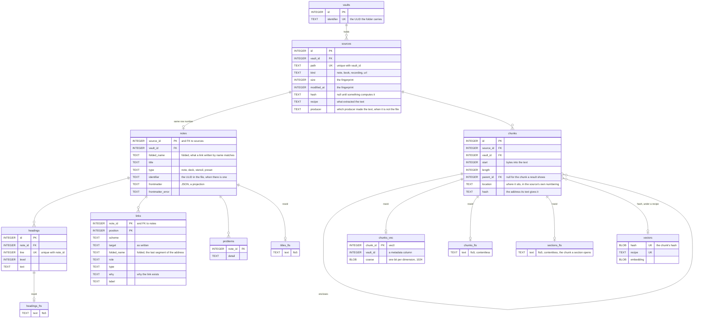

# What the index stores

- **Status:** Accepted
- **Date:** 2026-08-25
- **Applies to:** `modules/libs/core`
- **Related:** [Files on disk are the source of truth](0001-files-are-the-source-of-truth.md), [One database for all vaults, outside them](0002-one-database-for-all-vaults.md), [A schema change is a numbered migration](0007-a-schema-change-is-a-numbered-migration.md), [A vault is scanned in the background](0008-a-vault-is-scanned-in-the-background.md), [Text is cut twice](0011-text-is-cut-twice.md), [A chunk is identified by its text](0012-a-chunk-is-identified-by-its-text.md), [One search, three rankings, merged by rank](0014-one-search-three-rankings.md), [The application writes to the vault](0017-the-application-writes-to-the-vault.md), [The stencil, the deck and the card](0026-the-stencil-and-the-deck.md)

## Context

The vaults are the truth and the index is what makes them answerable. It holds one schema for every vault, and what may be put in it is what every later question is asked of. How that schema moves from one shape to the next is [A schema change is a numbered migration](0007-a-schema-change-is-a-numbered-migration.md).

## Decision

### Nothing is stored without a reader today

A scan stores what something reads now. A field nothing asks for is not stored, however cheap it was to produce while a parser was already open.

### The schema

**A file of any kind is a `sources` row.** Its path, its size and its modification time are there, and they are what the next scan answers "has this changed" with, without opening the file. `kind` says what sort of file it is; `hash` is the address the content gives it, and is what lets a moved file keep what was derived from it. `recipe` is what extracted the text and is null while nothing has. What only one kind has is a table of its own.

**A note's row number is its source's**, so a question that needs only the file joins `sources` on it. What the note table adds is the names a link reaches the note by, its title, the ULID the file carries when it carries one, and the frontmatter.

**Headings carry their level and their line**, and they are the outline of a note, the boundaries a cut falls on, and half of what the palette matches against.

**Links are stored as written**, with the last segment of the address kept beside them as the name the backwards question is answered through.

**A problem is what could not be acted on and is worth showing**: a link with no role, a target nothing understands. Frontmatter that would not parse stays on the note it broke. Both are read together, so a vault's problems are a query.

**The body is indexed over chunks.** `chunks_fts` keeps no copy of what it indexed: a chunk says where in a file its text is, and showing a passage reads the file. A lexical hit and a dense hit name the same row, so both are placed in one list and read back the same way. A chunk is identified by its text, a source is cut twice, and the two passes are merged by rank.

**`titles_fts` and `headings_fts` each keep a copy of the text they indexed.** What an answer draws is the name with the run that matched marked inside it, and an index can only say where it matched over text it holds. They are two tables because a title and a heading are each ranked against their own population.

**`sections_fts` is the names of the sections a source divides into**, keyed by the chunk each section opens, so a hit on a section's name is a passage standing at the start of that section.

**A vector is addressed by the text and the recipe**, never by a chunk's row number, and it is kept where a renumbering of chunks cannot reach it.

### A deck and a stencil are not searched by their text

A note of `type: deck` or `type: stencil` contributes no chunk, and therefore no vector. A card is found by its heading, which is its question; a stencil is found by its title, which is its file name.

A deck keeps its sections and its cards as headings — the first and second levels, and nothing below them. Its third level is the stencil's field names written out under every card, and deeper than that is a heading standing inside a value. A stencil keeps no heading at all. Every other note is unchanged.

A card's heading reaches the index without the mark it carries: the mark is written for the file, not for a person reading a list.

A deck and a stencil are still notes in every other way: a row of their own, a title, a type, an identifier, their links resolved and their backlinks answered, a node in the plex with their headings hanging under it.

### Resolution is a query, never a column

A link is kept as it was written, and where it points is worked out when the question is asked. Adding a file mends a link that was dangling, and deleting one breaks a link that worked, with no row touched either way.

### A note is a number inside the index and a vault-and-path outside

Headings, links, problems, chunks and full-text rows are all filed under that number. What the index calls a note is not visible past it: the ports speak in vaults and paths, and the translation happens once per question.

### Parsed frontmatter is a projection

JSON has no key order, no duplicate keys and no YAML timestamps, so what the index holds is what could be represented. It is enough to query and not enough to write back: the file is the only verbatim copy, and anything editing frontmatter reads the file ([the note format](../note-format.md)).

### The index knows its own shape, and a plan is asserted by its index

SQLite chooses between the ways it could answer a question from what it knows about how much is stored and how it is spread. A scan that indexed or removed something measures the database afterwards; a scan that stored nothing does not.

The measurement samples large tables and covers the whole database, including tables the connection that asks has never read from. The core states that the index has changed; how a database is measured is the adapter's.

Tests that check query plans name the index each question has to be answered through, and they measure the database the way the application does.

## Consequences

- A feature wanting something the schema does not hold costs a migration and, where it cannot be derived, a rescan.
- Resolution being a query puts the backlink question's plan on the critical path, and that plan is asserted by name.
- Frontmatter is queryable from the index and writable only through the file.
- Nothing cascades into a virtual table, so a chunk's rows in `chunks_vec`, `chunks_fts` and `sections_fts` are deleted by the code that deletes the chunk.
- A scan that stored nothing leaves the plans standing on the last measurement.
- **The words inside a card are not findable.** A person looking for a card looks for its question. This is the one thing given up, and it is given up knowingly.
- **The name search is not crowded by one deck.** A stencil's four field names would otherwise stand in it once per card.

## Alternatives considered

**Keeping a deck's chunks and dropping its vectors.** Rejected: the full search over a deck answers with a fragment out of the middle of a card, which is neither the question nor the answer, and the chunk table carries it for that.

**Keeping a deck's headings and dropping only its chunks.** Rejected: the field names are the largest part of what a deck contributes and the least of what it means. They are the stencil's vocabulary, and the stencil is where they are already written once.

**Storing a card as one chunk, so a card is found whole.** Rejected: it is a second way to search cards, beside the review that exists to show them, and nothing has asked for it. Where it turns out to be wanted, a deck's cards are a thing to search on purpose — not the by-product of treating a deck as prose.

**Leaving a stencil searchable, since there are few of them.** Rejected: a stencil holds `{{Field}}` and two words per face. Few of them is a reason it costs little, not a reason it earns anything.

**Store where each link resolves.** Rejected: a file appearing or disappearing changes the answer, so the column is stale as often as the vault is edited.

**Store everything a parser can cheaply extract** — tags, inline fields, word counts. Rejected: each is a parsing rule the person's files come to depend on, and none of them had a reader.

**Keep the body text beside the chunk that indexed it.** Rejected: the vault would be held twice, and a passage is read from the file it is in. Titles and headings are held because the answer marks the run that matched inside them.
