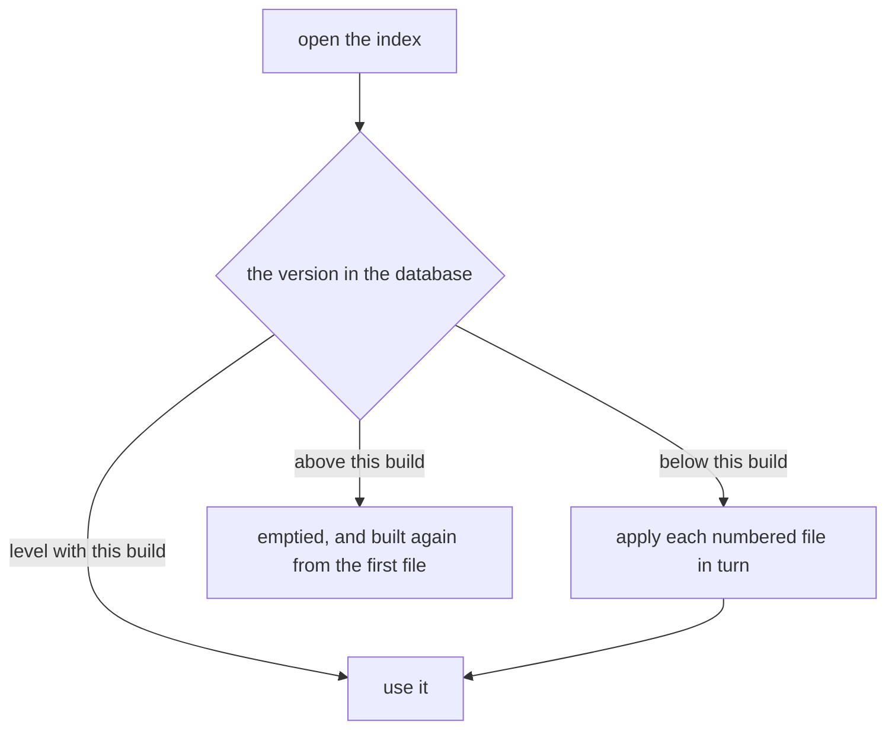

# A schema change is a numbered migration

- **Status:** Accepted
- **Date:** 2026-08-25
- **Applies to:** `modules/libs/core`
- **Related:** [One database for all vaults, outside them](0002-one-database-for-all-vaults.md), [A hexagonal core in Go](0004-a-hexagonal-core-in-go.md), [What the index stores](0006-what-the-index-stores.md), [A vault is scanned in the background](0008-a-vault-is-scanned-in-the-background.md)

## Context

One database holds every vault, its schema grows with the application, and it sits on somebody's machine while it grows. What the index may hold is [What the index stores](0006-what-the-index-stores.md). How it moves from one shape to the next is settled here, because every later change to the schema is written inside the answer.

## Decision

### The schema version lives in the database

The database says which shape it is in. Opening it is reading that version and comparing it with the versions this build carries.

### A change ships as a numbered file

Migrations are `.sql` files under `adapter/index/migration/`, named `NNNN_description.sql`, applied in order, once each. A file that is not numbered is an error, and two files sharing a number are an error.

### The sequence starts at the shape the first release ships

The first release ships one file, `0001_index.sql`, and it is the whole schema. A sequence is collapsed only while every file in it is a file no released build has run: what nobody's index was brought through is not a step anybody's index has to be brought through again. Once a build carrying a numbered file is released, that file stays, and the schema moves by another number after it.

### A migration and its version bump are one transaction

Each numbered file runs together with the bump that records it, so the database stands at the last version that applied whole.

### Only a numbered migration empties anything

A migration may empty the tables it changes, saying so in its own file, and the next scan refills them. It empties its own tables and no others. Nothing outside a migration file empties anything, save the coarse vector index: its width is a model's, so a model of another width rebuilds that one table from the vectors already bought.

### The `schema_migrations` table says which file brought the index to which version

Beside the version the index keeps a `schema_migrations` table: a version, and the name of the numbered file that reached it. It is not itself a numbered migration — it is what says whether those ran — so the index creates it where it is missing, and a table carrying a column this build does not write is brought to the two columns this build writes.

### An index at a version this build does not carry is built again

A schema this build does not carry holds what it cannot read. The index is a cache — what it holds is a reading of the vault, and the next scan reads the vault again — so it is emptied and migrated from the first file rather than refused. Refusing it stopped the application before its window opened, on a database it is free to throw away, and told the person to find the build that wrote it, which after a collapsed sequence is older than the one refusing.

The cost is a full re-scan and re-embed, which is minutes of work and not nothing. It is still the smaller cost of the two.

## Consequences

- Migrations are forward-only and accumulate, and each is code that runs on somebody's machine years later.
- A migrated database and a fresh one can differ, and nothing compares them.
- A half-applied change does not exist; a failure leaves the last whole version.
- An index a later build wrote costs a person the scan and the embedding again, and stops nothing.
- A migration that empties a table costs the person the next scan over it.

## Alternatives considered

**Drop and rebuild the index on any schema change.** Rejected on cost: it is the correct fallback and the wrong default, since a column added for a feature somebody does not use would cost them a re-read of every vault.

**Read the shape of the database and work out what is missing.** Rejected: the tables say what is there and never which changes ran, so two databases that arrived at one shape by different routes are indistinguishable.

**Name migrations by timestamp or by hash, applied in any order.** Rejected: a number is what makes the order the same on every machine, and two branches merging produce a sequence no machine has run.
