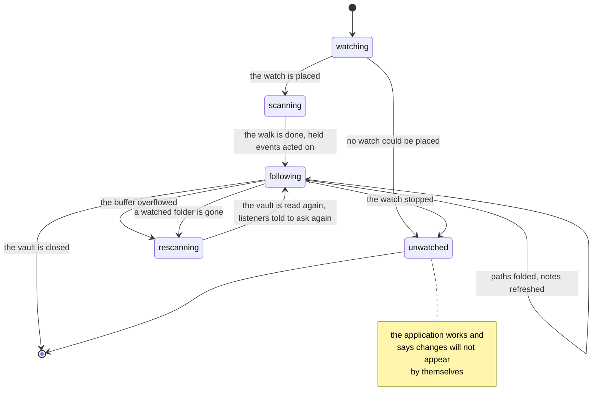

# ADR-0009: The vault is watched

- **Status:** Accepted
- **Date:** 2026-08-25
- **Applies to:** `modules/apps/desktop`
- **Related:** ADR-0001, ADR-0005, ADR-0006, ADR-0008

## Context

A vault is edited by whatever the person opens it with: this application, an editor beside it, a synchroniser, a checkout. The index is level with the vault until one of them writes. A scan (ADR-0008) reads the whole vault; what says which files changed since is settled here.

## Decision

### The vault is watched as a tree, through the system's own recursion

macOS and Windows watch a tree in one call; Linux and BSD take one directory each and the tree is maintained as folders come and go. The library takes the system's recursion where there is one.

**A watch is on a directory, never on a file.** An editor saves by writing a temporary file and renaming it over the original.

### One skip rule answers for the walk and for the watcher

What counts as a note, what the service folder is called, and what the vault says to leave alone are asked of the same reader by the walk and by the watcher. What is configured, and in what syntax, is in [settings](../settings.md) and [the note format](../note-format.md).

### Events fold by path over a hold

One save is several events and a path arrives many times in a moment. Events are read into a buffer, held briefly, and folded so a path is reported once however often it was named. The hold is measured from the first event of a batch.

Reading events and delivering them are kept apart. A listener takes as long as it takes to refresh what it was told about, and the system goes on producing events meanwhile.

### What cannot be worked out is read again

**An overflowing buffer forces a rescan.** A restore, a checkout, an archive unpacked arrive in thousands, and what was dropped past the end of the buffer is unknowable.

**A folder that has gone forces a rescan**, because its contents are known only to the index. A path arriving from outside the vault is that same case, and is what a watched folder renamed away looks like. Which paths are folders is remembered while they are there, which is the one moment the question is answerable.

### The watcher reports paths

It produces the set of sources that changed and nothing about them. Whoever listens knows what it is showing and asks for what it needs; the client hears about it over ADR-0005's stream.

### A vault that cannot be watched says so

The number of watches an operating system grants is limited and a large vault can exhaust it. The application keeps working, scans as it does, and says that changes will not appear by themselves. It says the same when the watch stops under it.

### The watch is placed before the first scan and run after it

An edit made while the vault is being read is held meanwhile, and a scan's copy of a note lands last however early that note was read.

## Consequences

- Between an event and the reindex, the index and the disk differ.
- The index has two ways to change, and they can disagree; both are tested against the same vault.
- Watching costs a system resource a large vault can run out of, and the answer is a message.
- A vault written to continuously is refreshed one hold after each batch opens.
- An overflow or a folder renamed away costs a walk of the whole vault.
- A listener that is slow to refresh delays no other listener.

## Alternatives considered

**Polling — the scan on a timer.** Rejected by arithmetic: a timer short enough to feel immediate spends the machine on walking the vault, and one long enough to be cheap is not following anything.

**fsnotify.** Rejected: recursive watching is not in its public API, and on macOS it uses kqueue — a file descriptor per file, which a vault of this size exhausts. Both platforms that watch a tree natively would be emulated.

**Sending the changed note with the event.** Rejected: it puts a note's whole shape into a message whose job is to say that something happened, usually to somebody not showing it.
