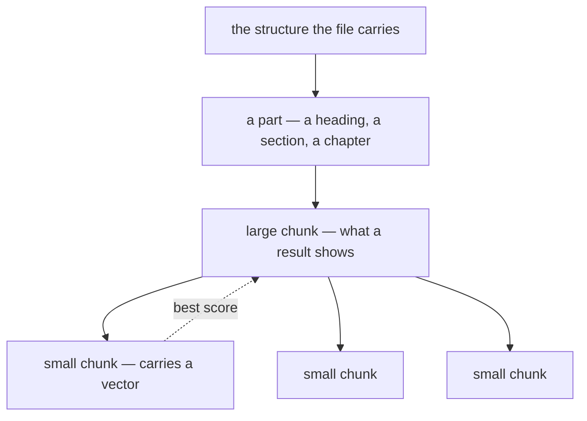

# ADR-0011: Text is cut twice

- **Status:** Accepted
- **Date:** 2026-08-25
- **Applies to:** `modules/apps/desktop`
- **Related:** ADR-0010, ADR-0012, ADR-0013, ADR-0014, ADR-0015, ADR-0016

## Context

A vector describes the whole chunk it was made from, so how the text is cut decides what can be found at all. The size that keeps one sentence findable and the size that gives a person enough to read are not the same size, and one cut cannot be both.

## Decision

### The text is cut twice

**A small chunk is searched; the large chunk enclosing it is read.** The small chunk carries the vector. The large chunk is what a result shows. Several small chunks of one large chunk collapse to it, keeping the best score.

Both cuts follow the structure the file already carries — headings in a note, the sections of a translation, the chapter a verse edition numbers. A chunk is cut inside one part's text, never across a part into the next.

A note is cut into the same small chunks as a book, and a note's large chunk is the note itself.

**A title is not embedded.**

### A chunk is bounded in words

A file that puts a whole book on four lines is cut like any other. The small chunk is checked against the model's input limit and stays under it with margin.

The word counts, the two overlaps and the legibility thresholds are constants in `cutting`. The character limit is the one value settings reach, and it is derived from the model's input limit.

## Consequences

- Two cuts of one text are stored, and the small one multiplies the number of vectors several times over.
- A part shorter than the small chunk is a chunk of its own.
- Sizes tuned against one corpus are not guaranteed on another, and the acceptance set is what makes a bad choice visible (ADR-0014).
- A model with a smaller input limit forces the small chunk down, and the cut moves with it (ADR-0012).
- What the sizes cost to store and to embed is in [performance](../performance.md).

## Alternatives considered

**One chunk size, chosen as a compromise.** Rejected on measurement: the sizes that keep a specific sentence findable are too small to read, and the sizes that read well bury it.

**Cut a note differently from a book.** Rejected: similarity varies with the length of what is embedded, and one mixed ranking is one population.

**Embed the title with the note.** Rejected: it is too short to place, and the lexical index already matches it.
