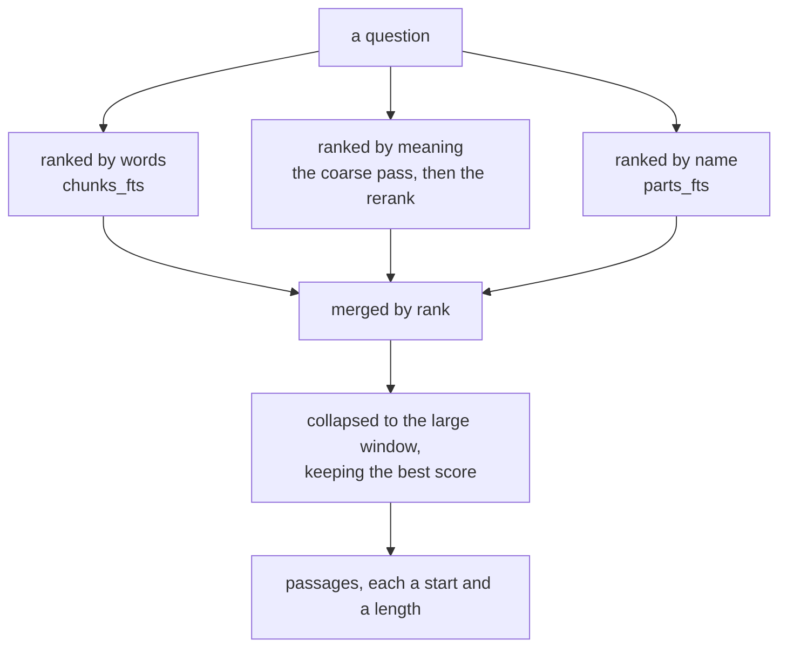

# ADR-0014: One search, three rankings, merged by rank

- **Status:** Accepted
- **Date:** 2026-08-25
- **Applies to:** `modules/apps/desktop`
- **Related:** ADR-0006, ADR-0010, ADR-0011, ADR-0012, ADR-0013, ADR-0016, ADR-0021, ADR-0025

## Context

The index answers where an idea appears, over a vault holding notes and books together. A person asking for a name spelled a particular way and a person asking for a thing they cannot name are asking one search. What comes back is passages, and how many of them one book is allowed is not the index's to decide.

## Decision

### There is one search, and the indexes are parameters of it

The words in a chunk, the meaning of a chunk, and the names of the parts a source divides into are three orders over the same unit. A lexical hit, a dense hit and a name hit all resolve to a chunk, so they are placed in one list and read back the same way.

### Rankings merge by rank

A chunk's score is the sum of `1 / (k + rank)` over the rankings that returned it, counting from one. **Scores are never combined.** Equal scores are ordered by source and then by chunk, so one index gives one answer.

**The lexical half stays exact.** Anything spelled precisely — a name, a citation, a phrase quoted the way it is written — is a lexical question, and no window size makes it a dense one.

### How many passages one document answers with is the caller's

`Each` says it; zero is one, and a document names itself once. A list a person runs their eye down wants one line per book, and a reader who cannot turn the page wants the several places a book speaks about a thing.

Where a document has a section named what was asked for, that section stands as the first passage it answers with.

### Acceptance is a rank

Search is checked by a set of questions whose answers are known, and what is checked is where the known answer ranks. A change that leaves everything else untouched can still move the right passage out of reach, and only this test sees it. A latency is not an acceptance criterion for search; what is timed is in [performance](../performance.md).

## Consequences

- A chunk one ranking found can outrank a chunk two found, and no score says why.
- Every ranking runs for every question, whatever the question looks like.
- Adding or dropping a ranking reorders every answer, and the acceptance set is where that is seen.
- The acceptance set is written against a corpus, and a question whose answer changes is rewritten by hand.

## Alternatives considered

**Combine the scores.** Rejected: BM25 and cosine similarity are not comparable — one is unbounded and drawn from the corpus, the other a bounded angle — so a weighted sum is a calibration per corpus and per model, and merging ranks calibrates nothing.

**One dense ranking, with the window size tuned to carry the lexical work.** Rejected: a name, a citation and a quoted phrase are asked for as spelled, and no window size makes them findable by meaning.

**Fix the number of passages a document answers with at one.** Rejected: a reader who cannot turn the page wants every place a book speaks about a thing, and one line per book is a different question asked of the same index.
