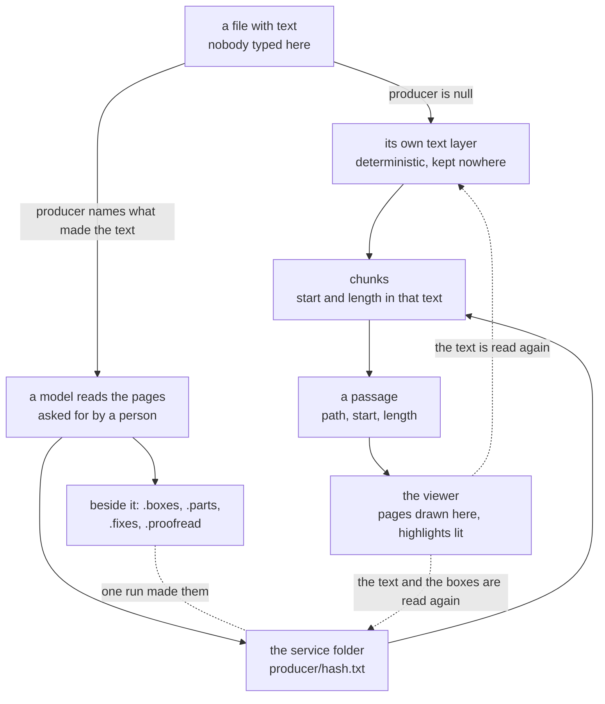

# A book's text is a cache or an artifact

- **Status:** Accepted
- **Date:** 2026-08-25
- **Applies to:** `modules/libs/core`
- **Related:** [Files on disk are the source of truth](0001-files-are-the-source-of-truth.md), [A vault carries its identity, and application state lives with the application](0003-a-vault-carries-its-identity.md), [A hexagonal core in Go](0004-a-hexagonal-core-in-go.md), [A source is text in one table](0010-a-source-is-text-in-one-table.md), [Text is cut twice](0011-text-is-cut-twice.md), [A passage is a range of bytes](0016-a-passage-is-a-range-of-bytes.md), [The application writes to the vault](0017-the-application-writes-to-the-vault.md)

## Context

A book in a vault is two things wearing one extension. Some carry a text layer a machine takes out deterministically. Some are photographs of paper and carry nothing. Some carry a layer that is somebody else's recognition, which looks like the first and behaves like the second.

What produced a source's text decides what its chunks are offsets into, and where a passage is read back from.

## Decision

### One kind of source, and the recipe names what read it

One source kind covers every file with text nobody typed here. What takes the text out is decided from the file's name and recorded in the recipe, together with the sizes the text was cut into.

**The staleness question takes the set of recipes now in use**, and a source carrying none of them owes its text. There is a recipe for every reader, because what took the text out is part of what produced the offsets, and a vault holds files of more than one format.

### A text layer is a cache; a model's reading is an artifact

A text layer is deterministic local extraction, so it is read on every scan and stored nowhere. A model's reading is not reproducible, so it is written into the vault's service folder and the source is cut from it afterwards.

### Nothing chooses between them automatically

**The layer is used, always. Recognition is something a person asks for.**

There is no reliable test of a text layer. A page of Chinese inside an English book is ordinary; a page of English recognised as Chinese is a defect; and nothing in the words says which. Which documents have been read is a question the index answers, so an agent asking for one is asking about a document it can see the state of.

### `producer` names what made the text

It holds a producer, never a filename. The files one reading is kept under are all composed from the producer and the hash, and the hash is a column already, so a name is composed where it is needed.

Three rules hold it together.

1. The column is authoritative for reading a passage back. **A source naming a producer reads from that producer's files or reads nothing.** One text sliced at another text's offsets is a wrong answer given confidently.
2. It is written by the same statement that writes the chunks cut from that text, and cleared by the same write that clears `hash` and `recipe`. The file not being the file that was read is one fact and one write.
3. **A reading is named by the hash of the bytes it was made from.** A document renamed or moved keeps its recognition, and two copies of one document share one reading.

Rule 3 is also what a sweep asks. A source that leaves the vault takes the files of its reading with it, and the question is whether **any** source still names that reading, never whether the path that named it went.

`producer` is not in the recipe. **A recipe names a procedure**, and it is compared against the strings the running binary produces, so a per-source value in it would leave every recognised source permanently unequal to all of them.

### One reader type answers for every kind of source

An extractor cutting a source, a search showing a passage and an embedder re-slicing a chunk all ask the same type. Three answers that drift are three ways to read the wrong place.

### The artifact lives in the service folder

A recognition goes under the application's own folder inside the vault. The walk skips that folder and every path in it is refused to the vault's own writer; containment splits into two complements, the vault as the person's and the folder as the application's, and a path belongs to exactly one of them. A separate port and a separate type write there, and `VaultWriter`, which an agent can reach, cannot.

One run makes the prose, the coordinates it was read from, the parts it divides into, the corrections a proofreader made, how far that proofreader got, and the record of which models produced it. None of them means anything without the others, and a sweep takes them together.

The area is named for what made the files. Their format, the fields recorded beside them and what a place in one is called all belong to the thing that wrote them, and no shared shape is defined for a producer that does not exist. What one reading holds, page by page, is [`../reading.md`](../reading.md).

### A run batches, writes its count last, resumes, and cuts after each batch

Recognition and proofreading each read in batches. Pages are appended, and the count of how far the run got is appended after them: **the count is what makes the batch in front of it count**, so a batch that did not land whole is one no count claims and the next run does it again, trimming what stands past the count first.

The source is cut after every batch, so a book answers about the pages already read while the rest is still being read. While a run is on, the source is cut from what has been read so far.

**Neither run rewrites what the other wrote.** What the recogniser produced stays on disk under its own name, and corrections go beside it keyed by the printed line. Putting a line's letters right leaves its words where they were, so the rectangles hold, and composing the corrected prose moves the boxes, the page marks and the parts in one pass.

Where the proofreading service has a queue, one run collects the batch that is out and leaves the next, and the batch's name stands beside the reading, so a batch left before the application closed is collected when it opens. The gates a reply passes and the grammar of that reply are in [`../proofreading.md`](../proofreading.md).

## Consequences

- Dropping a document into a folder is the whole gesture, and it costs no models, no weights and no network.
- The service folder now holds something that is not disposable.
- A recognition is only as good as the models, and a recogniser that cannot spell a script writes plausible nonsense that only the legibility thresholds catch.
- Two paths through one format is two paths to keep working, and only one of them is exercised by a document that carries text.
- A run that dies among the writes leaves work ahead of the count for the next run to trim back.
- Proofreading is a key, a network and money, and a refused page is paid for.

## Alternatives considered

**A heuristic on the text layer** — unknown words, missing marks, a language guess. Rejected: every measure of "is this text good" is a measure of "is this text like what I expected", and a vault holds what it holds.

**The artifact beside the document** (`book.pdf.md`). Rejected: it is a file in the vault, so it is walked, indexed and linkable as a note, and moving the document leaves it behind. The application's own folder is where the application writes.

**The artifact as a source of its own row.** Rejected: the walk skips the service folder, so the row could only be conjured out of band; a search hit would carry the artifact's path, and the document is what a person opens; and the two rows would need joining back together by a column pointing the wrong way for reading a passage.
