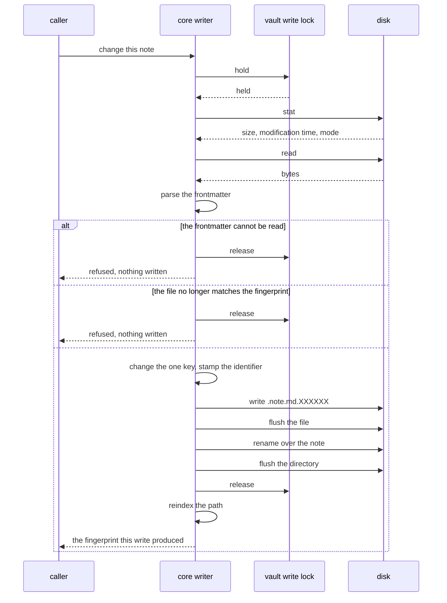

# ADR-0017: The application writes to the vault

- **Status:** Accepted
- **Date:** 2026-08-25
- **Applies to:** `modules/apps/desktop` — `internal/core/usecase/note`, `internal/adapter/filesystem`
- **Related:** ADR-0001, ADR-0006, ADR-0008, ADR-0018, ADR-0019, ADR-0020,
  ADR-0021

## Context

The window, an agent and the command line all change notes the person also edits
in their own editor. The file is the source of truth and the person is its
author; the application arrives afterwards, changes one thing, and leaves
everything else as it found it — including what it does not understand.

What a write does to a vault — how a note is created and named, what a rename
brings into line, when a backlink is repaired, where a removed note goes, what
the problems view shows — is in [editing](../editing.md). This decision is the
mechanics underneath: how bytes reach a file, what a write refuses, and where the
rules live.

## Decision

### One edit, from caller to disk

The lock is ADR-0020's, taken before the stat and held past the rename.

### A write lands whole or not at all

A note is written to a temporary file beside it and renamed over the top. The
temporary name begins with a dot, and a name beginning with a dot is not a note,
so the watcher never reports it.

The contents are flushed before the rename and the directory is flushed after
it. A filesystem that will not open a directory for that flush is one that did
not need it, and its refusal is not handed back.

### A note that is already there keeps the mode it has

A note the application creates is written `0644`. A note already on disk is
written with the permissions it carries: a person may have made one read-only,
and that is their statement about the file. Setting the mode moves no
modification time.

### The frontmatter is spliced, never rebuilt

The frontmatter is round-tripped through its parse tree. The span of one key is
replaced and the rest of the file is never rewritten, so keys the application
does not own survive with their order, their comments and their quoting. A
comment written above the next key stays with that key.

Line endings are decided per file. The body is not reflowed. A file that arrives
with a final newline keeps one.

Two layouts cannot be spliced a key at a time: a block written on one line, where
the span of any key is the span of all of them, and a block opened and never
closed. A note laid out either way is left alone.

### A note whose frontmatter did not parse is never written

The block is reported. Repairing it means guessing at what the person wrote, and
writing around it means dropping what could not be read.

### A caller may present a fingerprint

The fingerprint is the file's size and modification time, which is what the index
keeps. A caller that read a note, thought about it, and arrived at a file that no
longer matches is refused and nothing is written. What comes back from a write is
the fingerprint of the file that write produced, which is what the caller presents
next.

A caller putting down what is in front of a person presents the prose it last
read. A file holding prose that caller has not read is refused under the same
rule.

### A body is prose, and it has a bound

A body that opens with the frontmatter delimiter is refused: written down, it
reads back as the note's own frontmatter block. A body over one mebibyte is
refused, which is the bound a note is read under.

### An operation over many notes reports per note

Fifty renames are fifty renames, and the twenty-ninth fails on its own. An
operation over many notes answers with what happened to each and never presents
itself as all-or-nothing.

### The rules live in the core writer

`VaultWriter` takes a path and bytes; what belongs in a note is the core's
business. Every caller reaches the same use cases, so the window, an agent and
the command line hold these rules by using them.

### What is derived goes through another port

A file the application made and cannot make again is written through a separate
port, into the application's own folder inside the vault. That port refuses every
name outside its own area, and `VaultWriter` writes no note inside it.

## Consequences

- Splicing a parse tree is work paid on every write, forever.
- Frontmatter written on one line, or opened and never closed, cannot be changed
  at all through this application.
- The fingerprint is size and modification time, so a change that moves neither
  passes as no change.
- An operation over many notes can stop part of the way, and the vault is then in
  whatever state each note reached.
- The mode is carried across and never consulted, so a note the person made
  read-only is still written when they ask the application to change it.

## Alternatives considered

**Marshal the frontmatter from a struct and write it back.** Rejected: it is the
straightforward implementation, and it destroys every key, comment and ordering
the application has no field for.

**Write the note in place, with no temporary file.** Rejected: a machine that
stops between the first byte and the last leaves half a note where a whole one
was.

**One transaction over a batch of notes.** Rejected: the filesystem offers
nothing of the kind, and an operation that claimed it would make a partial
failure look total.
