# ADR-0019: A note is identified by a ULID in its frontmatter

- **Status:** Accepted
- **Date:** 2026-08-25
- **Applies to:** the vault format — every application that reads or writes one
- **Related:** ADR-0001, ADR-0006, ADR-0008, ADR-0017, ADR-0018

## Context

A path names a file until somebody moves it in a terminal, where a disappearance and an appearance are the same two events. Whatever is attached to a note — a link, a chunk, a position in the interface — is attached to something that has to survive that.

## Decision

### A note's identity is not its path

A note is identified by a ULID in the frontmatter key `id`. Lexicographic order is chronological order, so creation order comes with it.

### When the identifier is written

```mermaid
stateDiagram-v2
    direction LR
    state "no id" as none
    state "id" as has

    [*] --> none: written in another editor
    [*] --> has: created by the application

    none --> has: the application edits the contents — stamps
    none --> has: a rename that writes the title — stamps
    none --> none: a move — does not
    none --> none: a rename the filename alone carries — does not
    none --> none: the save of typed text — does not
    none --> none: a link repaired in this note — does not

    has --> has: every write; the identifier it has is the one it keeps
```

An identifier is written when the application creates a note, and when the application changes what is in one. It is never backfilled. A move renames a file, so the bytes on the other side are the bytes that went in. The save of what a person typed puts down their own text and adds nothing to it. Repairing a link changes an address inside one link, in a note whose author is not the reason the repair is happening.

A note carrying no identifier is a note in full: it is walked, parsed, indexed and searched. It is only not addressable by identifier.

### The content hash is taken over the whole file

Nothing is backfilled, so the application never produces a change to a file by itself, and the hash needs no split between the person's content and the application's.

## Consequences

- Two classes of note exist, and the interface has to say why one of them cannot be a link target.
- `id` is an ordinary English word taken as an owned key, and a person's own key of that name collides.
- `id:` is visible in the frontmatter of every note the application made.
- A note written elsewhere and only ever read here stays without an identifier for as long as the person leaves it alone.
- A file copied in a terminal brings its identifier with it, and the vault holds two notes claiming one.

## Alternatives considered

**Identity by path**, as editors that own their library do. Rejected: a rename made outside the application is a file gone and a file arrived, and whatever was attached to the note breaks in silence.

**Backfilling identifiers into every file on the first scan.** Rejected: it rewrites a whole vault on first launch, into files the person never opened here.

**A random UUID.** Rejected: creation order would become a field of its own, written by the same hand at the same moment and able to disagree with it.
