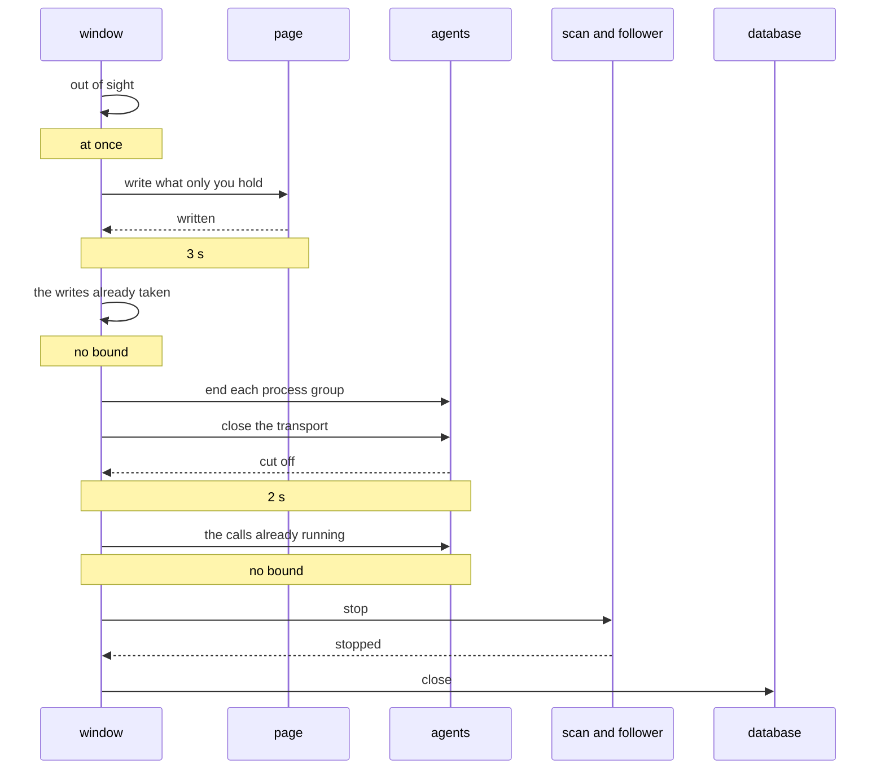

# ADR-0020: One process, one lifetime

- **Status:** Accepted
- **Date:** 2026-08-25
- **Applies to:** `modules/apps/desktop`
- **Related:** ADR-0004, ADR-0008, ADR-0017, ADR-0021, ADR-0022

## Context

Every change to a note is a read, a think and a write. An agent's edit is that shape, so is the link repair a move leaves in another note, and so is the save that carries what a person is typing. Each is correct only where its read and its rename are one act against the others.

The window is one operating-system process. That process is the boundary all of this is held inside, and it is also what ends: a quit has to leave the vault and the index in a state the next opening can read.

What a person is asked when the window goes — a tab whose save stopped, calling the quit off, a tab put off — is in [editing](../editing.md).

## Decision

### One vault has one write lock

A vault has one write lock, kept per vault root and keyed by the folder resolved through its symlinks, so every writer and every reader opened on one folder takes the same lock. A path that cannot be resolved is its own key: what is asked for is what is locked.

The index's single write connection (ADR-0008) is a different lock over a different thing. This one is the vault's.

### It is taken before the read and held past the rename

Every operation that reads a note and puts it back holds it across both: an agent's edit, the save of typed text, and the repair of a link a move left pointing at nothing.

**A create, the rename a move is, and a removal take nothing.** Each is one filesystem call over one name.

**The lock lives in this process.** Two windows on one vault hold a lock each, and that is the limit of what it serialises. A file synchroniser takes no part in it at all.

### The window goes in one order

The order is what each part needs from the next: the page holds text nothing else has, an agent writes through the core, the scan and the follower write to the index, and the database is what they write into.

**The window leaves the screen the moment it is asked to go, and the order runs behind it.** A hidden window is a page still drawing and still answered, so it hands over what only it holds with nothing in front of a person. The window is destroyed once the settling is over.

**A settling that ends with a question standing puts the window back.** The question is asked on the screen the person is looking at, and the close is asked for again once they have answered.

**A page has three seconds to hand over what it holds.** A page whose script has stopped answers never, and this is what that costs.

**The agents' transport has two seconds to be cut off.** A session an agent left open holds its connection until it is closed under it. The calls already running are waited for afterwards with no bound.

**The writes already taken are waited for with no bound.** The door is shut first, so what is left is a fixed set of filesystem operations.

A quit that does not arrive through the window is answered on the thread the page is served on, so the window is taken out of sight off that thread and the quit is asked for again once the settling is over. It happens once, whichever way the window is asked to go.

### The runtime a page is read through is made before the window

Every model this process runs is run through one ONNX Runtime environment, made once and kept for the life of the process. It is made before the window is, and a reading is refused where it was not.

A machine holding no runtime at all is left as it is, and a reading is what fetches one. The reading that fetched it says so, and the document is the next opening's to read.

### An agent does not outlive the window

Each agent runs in a process group of its own, and the group is ended with the window. A task in flight stops where it is, and what it had already written to the vault stays written.

A grandchild holding the child's error output keeps a wait from returning, so the pipes are let go of two seconds after the group is ended. This is the fourth bound on the machine.

## Consequences

- There is no lock between two processes on one vault: two windows, or a window and the command line, interleave their reads and renames.
- A create, a move and a removal are not serialised against a save, so a note renamed while a save is in the air leaves the tab at the name it was read from.
- A page that says nothing inside its bound loses what only it held.
- The process outlives the window on the screen, and on macOS the dock tile stays lit until it ends.
- A close a page calls off is a window that went and came back.
- A machine that fetched its runtime during a reading reads that document at the next opening, and is told so where the reading was asked for.
- A note an agent was part of the way through writing is whatever its last complete write left.
- Four bounds are four constants, and nothing measures what any of them is a bound on.

## Alternatives considered

**A lock file in the vault**, so that two processes serialise. Rejected for now: a lock a crashed process leaves behind is a vault nothing can write to, and the recovery is a person deleting a file they were never told about. The gap it would close is written above as a cost.

**One lock for the whole installation.** Rejected: one database holds every vault, and the writes here are to files, so two vaults have nothing to queue behind each other for.

**Let an agent finish, and keep the process alive until it does.** Rejected: the window is gone, nothing is drawing what the agent says, and the tools it writes through are served by the process that is leaving.
