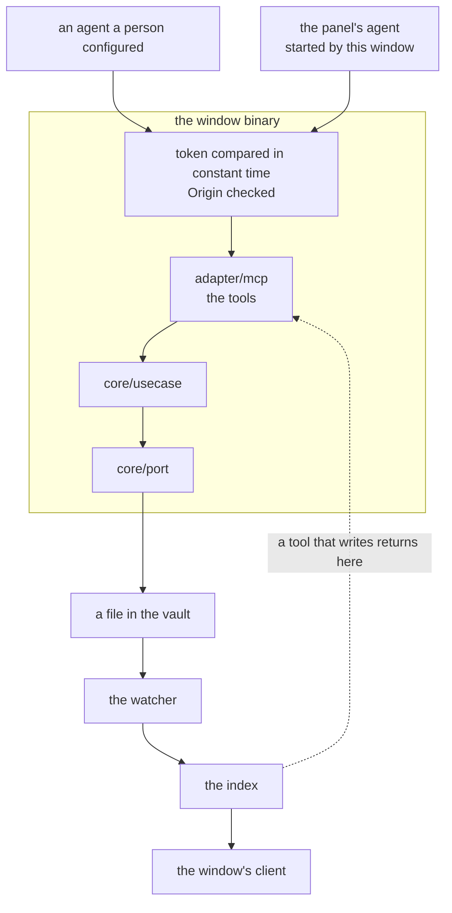

# ADR-0021: An agent reaches the vault through tools

- **Status:** Accepted
- **Date:** 2026-08-25
- **Applies to:** `modules/libs/core` — `adapter/mcp`
- **Related:** ADR-0004, ADR-0005, ADR-0009, ADR-0017, ADR-0020, ADR-0022

## Context

A language model working on someone's behalf reads a vault, changes it, and draws nothing. It arrives speaking a protocol of its own and expects to reach a server. The person watches what it does in the window they already have open.

## Decision

### An agent is a word of its own, and so is a tool

An **agent** is a program that acts on a vault on a person's behalf, through tools. A **tool** is one operation it can call.

Neither is a client. A client is generated from the protocol and draws what it is told (ADR-0005). An agent is written by someone else and acts.

### The tool endpoint is a driving adapter inside the window

`adapter/mcp` is compiled into the window binary and listens on a port. It knows nothing of the window, of the webview toolkit, or of the schema. It consumes the ports the core declares, as the command line does.

The agent this window starts for the panel is a port of its own, and reaches the vault through the same endpoint as any other (ADR-0022).

### The tool surface is authored

The tools are written by hand. The schema is shaped for a window — one focus, one neighbourhood, a stream of what changed. A tool surface is shaped for a model: few tools, named for what they do, described in prose the model reads before choosing. Both consume the same use cases. Two surfaces, one core.

### A call carrying names takes many; a call carrying a document's text takes one

Paths and links are written in a moment, so looking up twenty notes, moving twenty or joining twenty is one call. A note carries what the note says: several in one call means nothing reaches the vault until the last word of the last one, and a person watching a graph sees it move once, minutes late. Every note is worth a call of its own.

### A note has one address

A tool names a note by its path relative to the vault root — the same address the schema and the command line use. A note that can be named two ways is a note an agent has to keep two names for.

### One vault at a time, and the endpoint follows the window

Every tool works the vault the window is showing, and no other. `vault_list`, `vault_rename` and `vault_forget` are the list and what a person does to it, and a vault whose folder is gone is marked and stays on the list until somebody forgets it.

**No tool names a folder as a vault, and none opens another.** Both reach any folder on the machine, which is the one thing the containment above cannot bound, and both are what a person does through the picker.

The window opening another vault stops the endpoint and serves it again on the one the swap ended on. One swap holds that at a time, so a second waits for the first.

### The port is opened where a person asks for it

An agent named for the panel puts the tools on a port, since that is how the agent this window starts reaches them (ADR-0022). A person who runs an agent of their own asks for the port itself, by a setting. An installation asking for neither opens no port and mints no token: a port and a secret on somebody's machine belong to an installation that was asked for them.

### What is served, and to whom

The loopback interface, on a fixed port, by default. Any other address is allowed, and choosing one is said plainly at startup.

A token, always, compared in constant time. On loopback it is the second line of defence behind an unreachable port; anywhere else it is the only one. The `Origin` header is checked: a page open in a browser can reach a port on this machine, and is the one caller that arrives without being invited.

### The token is kept between launches, and the address is written beside it

An agent is configured once, by a person, in a file of its own. So the token is generated once and kept with the application's own state, and beside it goes the address the endpoint is answering on. Both files are written beside themselves and renamed over the top, at mode `0600`, and the address file is removed on the way out. A file left behind points the next agent at a dead port with a live-looking token.

### The tools ship in the binary a person runs

The binaries are split by build profile: a window links against the system's browser through cgo, and the command line is pure Go and cross-compiles. The tools go in a window, because they exist to be watched — `numen` serves them, and so does `numen-flashcards` over the surface ADR-0030 gives it. `numen-cli` is the developer's and automation's tool, and nothing of the tools is linked into it.

### A change reaches the window the way any other edit does

A tool writes a file. The watcher sees it, a refresh brings the index level, and every listening client is told (ADR-0009). There is no path reserved for an agent, so there is one path to get right and it is the one already tested.

**A tool that writes returns only once the index is level again.** An agent that creates a note and searches for it in the next breath finds it.

The tools themselves, family by family, and the limits on what one call may carry, are in [`../agents.md`](../agents.md).

## Consequences

- The repository opens a port where an installation asks for one, and what stands in front of it is a token and an origin check.
- A second surface to keep true as the core changes. Nothing generates it against the schema; only tests hold it there.
- An agent with write tools can damage a vault as thoroughly as a person can. The damage is visible and reversible (ADR-0017), which is weaker than prevention and is what is available.
- A tool that writes waits for a refresh, so a write costs what indexing that note costs.
- The tools are absent from the binary that cross-compiles.

## Alternatives considered

**A separate process serving the tools.** Rejected: the change an agent makes has to appear in the open window, so a second process would still have to reach the first, it would be a second writer against one index (ADR-0020), and it is a second thing for a person to start.

**Generating the tools from the schema.** Rejected: it produces a tool surface shaped by what a window needs to draw, and it makes both surfaces worse for the reader each was written for.

**Serving the generated handler on the port and teaching an agent the schema.** Rejected: an agent that must first be taught a schema spends its context learning one.
