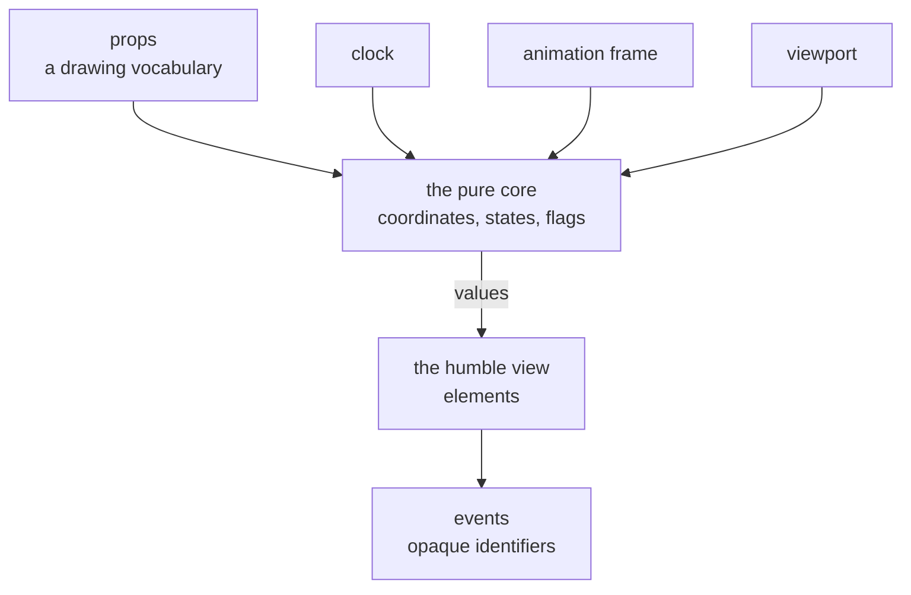

# How an interface component is built

- **Status:** Accepted
- **Date:** 2026-08-25
- **Applies to:** `modules/libs/ui`
- **Related:** [A hexagonal core in Go](0004-a-hexagonal-core-in-go.md), [A client is generated from the protocol](0005-a-client-is-generated-from-the-protocol.md), [The component library is shadcn-vue on Tailwind](0024-the-component-library-is-shadcn-vue.md), [How this application is tested](0025-how-this-application-is-tested.md)

## Context

The first component is the plex — the focused neighbourhood view the product is named for — and it is the hardest one this repository will contain. It moves, it is read by eye, and it draws things whose meaning is decided somewhere else. Whatever rules survive it hold for a button.

An interface is also the part of a system hardest to test. A scan is checked by reading rows out of a table; a drawing is not.

## Decision

### Vue 3 with TypeScript, in `modules/libs/ui`

The shell is a webview, and Vue's reactivity fits a view whose job is to re-derive a picture from a value that changed. TypeScript in strict mode, with `exactOptionalPropertyTypes` and `noUncheckedIndexedAccess`: a component's props are a contract with another module, and an unchecked one is not a contract.

### A component knows nothing about the domain

**This is the rule the module exists to keep, and every other rule here is downstream of it.**

No component imports a domain type or a wire type, and nothing in the module imports anything that knows what a vault is. Not in the components, not in the stories, not in the fixtures — a fixture taken from the domain is how the dependency comes back in through the door marked "tests".

A component takes props it defines itself, in a vocabulary about drawing, and emits events carrying **opaque identifiers**. Whoever renders it translates the domain into that shape and translates the identifier back. The plex speaks of *a node in a seat*; it has no way to ask what any of them mean.

The dependency runs `modules/apps/*` → `modules/libs/ui`. Never back, never sideways.

### The view is humble; the decisions are values

Every component splits in two.

**The core is pure.** Given the props, it computes what is to be drawn — every coordinate, every state, every derived flag — as plain values, with no DOM, no Vue, no clock, no randomness and no measurement of text. The same input gives the same numbers on any machine on any day.

**The view is humble.** It receives those values and turns them into elements. It works nothing out. A number appearing in the template that the core did not produce is a broken split.

**Anything with a lifetime a test must hold still is a port**: the clock, `requestAnimationFrame`, the size of the window. Each is a parameter with a browser-shaped default, so the component works with no ceremony in an application and is fully determined in a test. A reader who asks for less motion is answered in CSS, where the browser already knows the answer and no test wants it as a value.

### A concept is declared once

A role, a state, a variant — anything a component enumerates — is declared in **one** place, and everything varying with it reads from there: the type union, the layout, the wording, the colour. The unit of organisation is the thing, not the kind of thing, and that holds for a set of variants as it holds for a folder of SQL.

### A second behaviour is a function, never a mode flag

A component that will be asked to do a second thing takes the second thing as a function. The plex arranges a neighbourhood by handing the nodes to a strategy that decides where each of them goes; rows-and-columns is the one that ships, and a radial mind map is another implementation of the same signature.

This is taken only where a second implementation is intended. A knob with one setting is a knob nobody has read, and it costs a signature that has to be honoured forever.

### Styling is design tokens, and only design tokens

Every colour a component paints with is a CSS custom property in one file, and a component never writes one down. A size, a radius or a duration is a token where more than one component stands on it; a number only one component uses is written in that component, where it can be read beside what it moves.

**The tokens are declared on the root alone.** A custom property declared on an element beats the same property inherited from the root, whatever the selectors weigh. Components inherit from the root, which is what makes a `:root` block a theme.

**The root's font size is the interface multiplier**, so every `rem` in this product and in the toolkit beneath it carries. Each token sits in one of three groups, stated in the file beside its value: what follows the interface, what the text multiplier reaches as well, and what follows neither — a hairline, a border, a focus ring and the stroke of a handle are one physical line and stay in `px`.

What a theme is, and what a person may set, are in [`../themes.md`](../themes.md) and [`../settings.md`](../settings.md). What Tailwind and a copied-in component do with these tokens is [The component library is shadcn-vue on Tailwind](0024-the-component-library-is-shadcn-vue.md).

### Storybook is where a component is built

A component is written, looked at and judged in Storybook, in isolation, before any application renders it. A component built inside a screen is a component whose edge cases are whatever that screen happened to contain.

**The stories are the corpus, and they are awkward on purpose.** A component ships stories for the empty case, the single case, the far too many case, text that is not Latin, text far too long, text with nothing to break at, and no text at all.

**A setting is a control.** Anything reachable by turning a knob — a duration, a density, a toggle — is an `argType`, and a second story differing only by the value of one is deleted.

### How a component is tested

[How this application is tested](0025-how-this-application-is-tested.md).

## Consequences

- The humble split is visible before it pays. A component that only draws its props unchanged carries a core that does nothing.
- Refusing domain types means a translation layer in every application that renders a component, and the same mapping written twice where two applications do not share theirs.
- Storybook is a second toolchain to keep alive, and a story is code that ships to nobody.
- A strategy taken as an interface is a signature honoured even if the second implementation never arrives.
- The tokens are a compatibility surface. Renaming one breaks every theme written against it.

## Alternatives considered

**Components that take domain types directly.** Rejected: every component becomes a consumer of the vault format, and the module ends up versioned against the domain it was extracted to be independent of.

**A component that works out what it draws in its template.** Rejected: what it draws is then reproducible only by rendering it, and a coordinate that depends on a clock, a font or the size of a window is one no test can name.

**A component declaring custom properties of its own, themed one component at a time.** Rejected: a property declared on an element beats the same property inherited from the root, so a theme stops reaching that component, and the styling contract becomes as large as the module.
