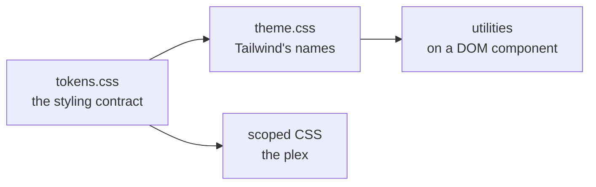

# The component library is built on Reka UI and Tailwind tokens

- **Status:** Accepted
- **Date:** 2026-08-25
- **Applies to:** `modules/libs/ui`
- **Related:** [How an interface component is built](0023-how-an-interface-component-is-built.md), [How this application is tested](0025-how-this-application-is-tested.md)

## Context

Beside the plex there are buttons, dialogs, menus, fields and popovers, and none of them is what this product is for. Their behaviour — focus, dismissal, keyboard order, what a screen reader is told — is where the defects are, and it is written down already in accessible headless primitives.

The module they arrive into has one styling contract and strict compiler settings.

## Decision

### Reka UI primitives, styled directly with Tailwind CSS

Components in `@numen/ui` are built directly on headless primitives from `reka-ui` for accessibility and keyboard interaction, styled directly with Tailwind CSS utilities. No external CLI component generator (such as shadcn CLI) is used, and the module owns its component implementations completely.

### Tailwind's theme is defined from the tokens, never the reverse

`tokens.css` is the whole styling contract. `theme.css` defines every name Tailwind paints with in terms of a token from it, so `bg-surface` and `var(--numen-surface)` resolve to one value.

### The theme is chosen by `color-scheme`, and no component writes `dark:`

The tokens are `light-dark()` pairs, so setting `color-scheme` changes every colour in the module at once. Tailwind's `dark:` variant reads a class or the operating system's setting and follows neither. No component in this module writes one.

### Where each way of styling applies

A component made of DOM is styled with utilities. The plex is styled with scoped CSS, because SVG attributes are what it paints with and no utility expresses them.

Component styles are unlayered and Tailwind's are in `@layer`, so **a scoped block silently overrides every utility on the same element**. A scoped block on a DOM component is for what a utility cannot say.

## Consequences

- The component library maintains full control over its accessible primitives and styles.
- Two ways of writing a style live in one module, and which applies where is clearly delineated.
- A scoped block outweighs every utility on the same element.

## Alternatives considered

**A heavy component framework installed as a package.** Rejected: what this module needs is full token control over design and strict compilation types.

**shadcn-vue CLI generation.** Rejected: generates extraneous configuration (`components.json`) and boilerplate that diverges from our token architecture. Direct composition over `reka-ui` is simpler and cleaner.

**Writing headless primitives from scratch.** Rejected: keyboard navigation, ARIA attributes, and focus traps are solved problems that `reka-ui` provides cleanly.
