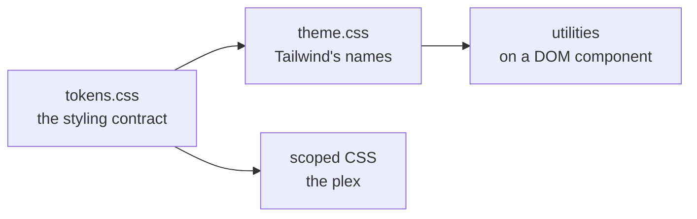

# ADR-0024: The component library is shadcn-vue on Tailwind

- **Status:** Accepted
- **Date:** 2026-08-25
- **Applies to:** `modules/libs/ui`
- **Related:** ADR-0023, ADR-0025

## Context

Beside the plex there are buttons, dialogs, menus, fields and popovers, and none of them is what this product is for. Their behaviour — focus, dismissal, keyboard order, what a screen reader is told — is where the defects are, and it is written down already.

The module they arrive into has one styling contract and strict compiler settings (ADR-0023).

## Decision

### shadcn-vue, with the components copied in

shadcn-vue is not a dependency. Its command-line tool copies a component's source into this module, and from that point the component is this module's own code. Underneath it are Reka UI for behaviour and Tailwind for styling.

**The components are edited on the way in**, and the edits are not cosmetic: a generated component arrives with a palette this module does not use, with `dark:` variants that do not work here, and with types this module's compiler settings reject. Owning the source is what makes those edits an edit.

A component is copied in when a screen needs it. The registry is not an inventory to be stocked.

### Tailwind's theme is defined from the tokens, never the reverse

`tokens.css` is the whole styling contract. `theme.css` defines every name Tailwind paints with in terms of a token from it, so `bg-surface` and `var(--numen-surface)` resolve to one value.

### The theme is chosen by `color-scheme`, and no component writes `dark:`

The tokens are `light-dark()` pairs, so setting `color-scheme` changes every colour in the module at once. Tailwind's `dark:` variant reads a class or the operating system's setting and follows neither. No component in this module writes one, and generated components have theirs removed as they are copied in.

### Where each way of styling applies

A component made of DOM is styled with utilities. The plex is styled with scoped CSS, because SVG attributes are what it paints with and no utility expresses them.

Component styles are unlayered and Tailwind's are in `@layer`, so **a scoped block silently overrides every utility on the same element**. A scoped block on a DOM component is for what a utility cannot say.

## Consequences

- Every component copied in has to be read and edited before it is kept, and a reviewer has to know that.
- Upstream fixes do not arrive. A defect corrected in shadcn-vue is corrected here by hand.
- Two ways of writing a style live in one module, and which applies where has to be known.
- A scoped block outweighs every utility on the same element, and nothing reports it.
- The screens are held to what has been copied in, and adding a control is a copy, a read and an edit.

## Alternatives considered

**A component library installed as a package.** Rejected: what this module changes on the way in is the source — the palette, the `dark:` variants and the types — and none of those is a setting a package exposes.

**Writing the components here.** Rejected: the behaviour underneath a dialog and a menu is the part that is hard and the part that is already written, and this repository would be maintaining it in order to own a button.

**PrimeVue.** Rejected. It is the stronger library where an application is mostly tables and forms, and this one is a plex, an editor, a review card and a conversation. Its theming is a system of its own, and the module would spend its life translating between two sets of tokens.
