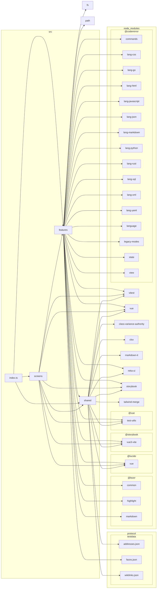
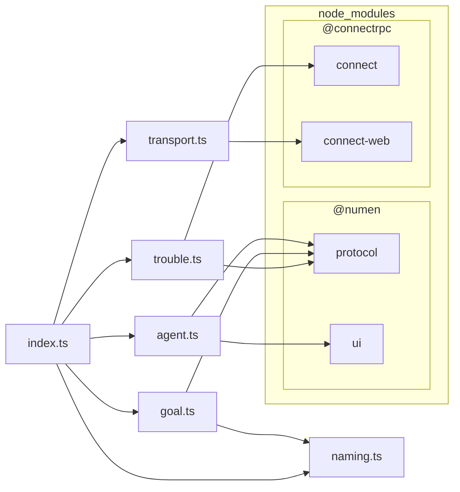
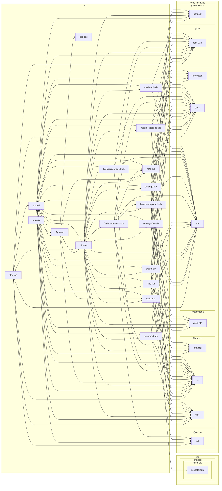
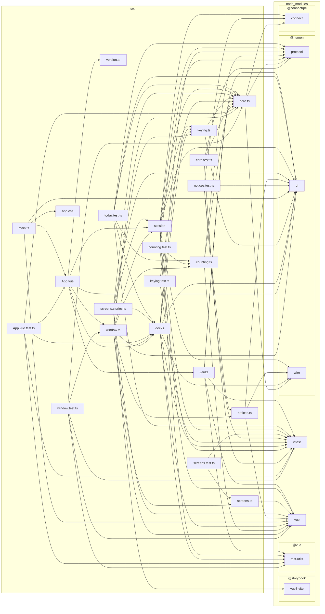
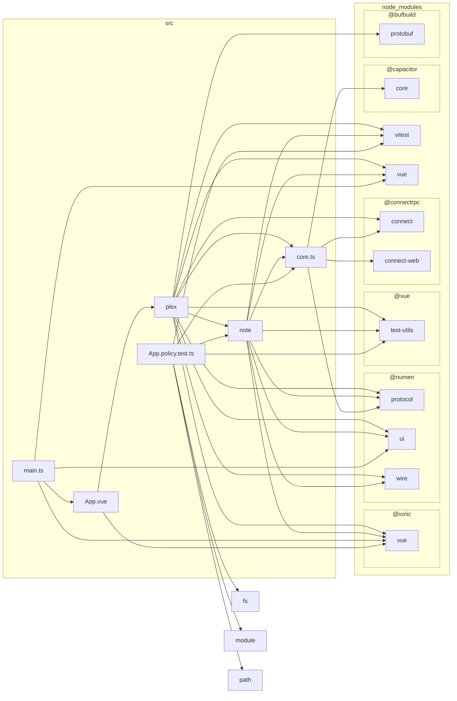

# What the interface modules depend on

Generated by `make graph`; edit nothing here. Each diagram is one module, collapsed to the folder a component lives in. What holds the direction is `modules/tools/depgraph/rules.cjs`: apps → libs/ui, never back and never sideways.

## @numen/ui

The shared components. Reaches nothing of ours.

`modules/libs/ui`

## @numen/wire

What a window's ports are answered with.

`modules/libs/wire`

## @numen/editor

The notes window: reaches the components, the wire and the schema.

`modules/apps/desktop/editor`

## @numen/flashcards

The review window: the same three, and never the other window.

`modules/apps/desktop/flashcards`

## @numen/mobile

The phone: one vault, the components and the schema.

`modules/apps/mobile`

