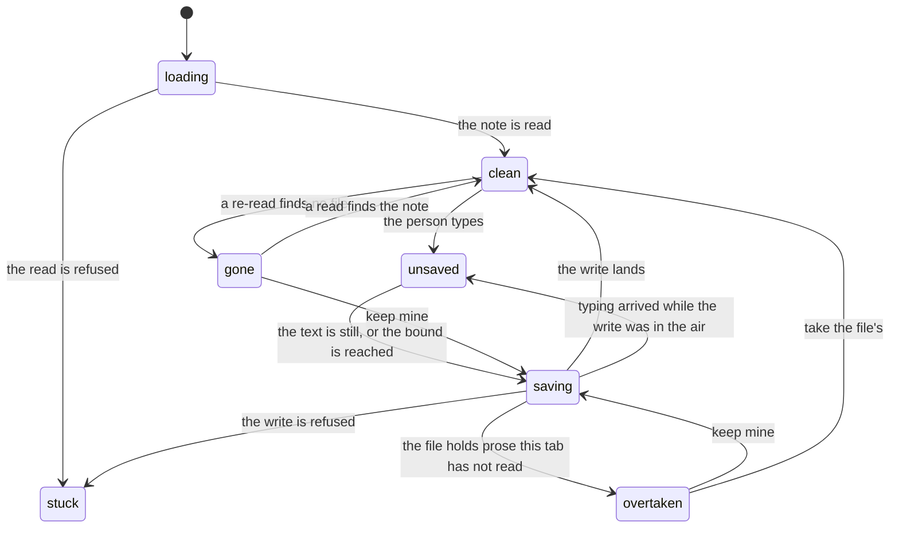

# A note in a tab

A note open in the window is three things: the prose on screen, the file it came
from, and the write on its way there. Saving is unasked — what a person types
reaches the file with nothing pressed and nothing asked. This page is what a tab
does with a note: when it writes, what it writes, what stops it, and what it says
while it is stopped.

Scope is one note in one tab, and the operations that move or rename the file
under it. The bytes of a note are [Note format](note-format.md); how a link finds
its target is [Links](links.md).

## Saving

Every change puts the write off again. Two things bring one on:

- the text has been still for 800 milliseconds;
- the oldest unwritten change is five seconds old.

Nothing changed is nothing written. `Ctrl+S` writes what is owed at the moment it
is pressed, under every rule below.

Closing a tab and quitting the window write what is owed and wait for it.
Renaming or removing the file does the same, and that write reaches the path the
tab still stands at.

A save reaches the index at once: the note is parsed again, cut again, and found
by word. Its vectors are asked for once the vault has been quiet for eight
seconds, and every write puts that pass off again. The cooldown is longer than
the bound above, so one sitting at one note is embedded once.

## What counts as a change

The save reads the file it is replacing and holds the prose there against the
prose the tab read. Two things are not a change:

- **Equal prose.** Text that is still what the tab was given is the text it read,
  whatever the file's size and modification time say. A synchroniser, a checkout
  and a touch move those over text nobody edited.
- **A file standing where this caller's own last write left it.** A write answers
  with the fingerprint of the file it made, and a caller presenting that
  fingerprint is presenting its own work. The prose there can differ from what
  the caller sent — a save gives a note the trailing break it is written with and
  the line endings the file already had.

The frontmatter is not compared. It is carried across.

## When the file was overtaken

Prose the tab has not read stops the save. Nothing is written, the tab carries
the mark `overtaken`, and the unasked save stops for that tab: what the person
typed stays in the buffer, and every keystroke after that leaves it there.
`Ctrl+S` stops here too.

The person answers with one of two, and the unasked save runs again afterwards:

- **keep mine** writes the tab's prose over the file, presenting nothing;
- **take the file's** reads the file again, and that read replaces the buffer.

A tab that is overtaken is answered before it closes and before the window quits.

### The states a tab is in

The predicates are read in order, so a tab is in exactly one state. The mark is
the one word the tab carries beside its title, and what a screen reader reads
out.

| State | What it means | Mark |
| --- | --- | --- |
| `loading` | the first read has not answered; there is no document to type into | — |
| `stuck` | reading or writing this note is impossible, and the tab says why | `stuck` |
| `gone` | the name the tab stands at has no file behind it | `gone` |
| `overtaken` | the file moved past the prose this tab read, and the save stopped | `overtaken` |
| `saving` | a write is in the air | `unsaved` |
| `unsaved` | what is shown differs from what was written | `unsaved` |
| `clean` | the file holds what is shown | — |

A tab is `stuck` on one of six refusals:

| Refusal | What the person is told |
| --- | --- |
| `tooLarge` | this note is longer than the editor holds |
| `bodyRefused` | a note begins below its frontmatter, and this text begins with one |
| `notANote` | this file is not a note |
| `notText` | this file is not text |
| `unreadable` | the frontmatter of this note cannot be read |
| `unreachable` | the vault could not be reached, so this note was not written |

A keystroke is worth trying again after three of them — `tooLarge`,
`bodyRefused` and `unreachable` — and typing clears the refusal. The other three
are conditions of the file. A tab held on a mendable refusal is told once when it
is asked to close, and goes the second time it is asked.

## What a save writes

The buffer holds the body. The save reads the file under the vault's write lock,
takes the frontmatter as it then stands, puts the body on it, and replaces the
file. The read and the rename are one act against every other write that reads a
note and puts it back — see [ADR-0020](adr/0020-one-process-one-lifetime.md).

**A save writes no identifier.** What it puts in the note is the person's. A note
the save makes — a name with no file behind it, kept — is made with no
frontmatter at all. An identifier arrives from the operations that change what is
in a note: a create, a link, a rename that writes the `title` key or the heading.
See [ADR-0019](adr/0019-a-note-is-identified-by-a-ulid.md).

**A note this application moves is followed.** The move knows both names, so the
tab takes the one the note now has and goes on reading and writing it there. It
is the move that says so, and this holds for every caller of one.

**A note that is gone is said.** A note gone from a name and not known to be
anywhere else leaves the tab open, showing what the person was reading, and the
tab carries the mark `gone`. The unasked save stops there. The note is made again
at that name on the person's word, and **keep mine** is what makes it.

The read is the check. A name is called gone when a read of it finds nothing, and
a read that finds the note again — at that name or the one it moved to — clears
the mark. A note renamed by something other than this application is a note gone
from one name and arrived at another, with nothing to connect the two. The tab
says the note is gone, which is what is known.

## Limits

**A megabyte is the most a note may be and still be read here.** The size is
asked of the file before it is opened, so a file over the bound is refused with
none of its bytes read, and the tab says which file and what the bound is. A body
handed back over the same number is refused by it too. The bound is the core's,
so what is refused to the window is refused to an agent.

**A body that opens with the frontmatter delimiter is refused.** A body is the
prose below the frontmatter, and a whole note handed back as prose is not one.

**A file that is not valid UTF-8 is not opened here.**

**Line endings are decided by the whole file.** Every break in the file is looked
at. A file whose breaks are all CRLF has its body written with CRLF; any other
file has its body written with LF, and a new file is written with LF. The
frontmatter arrives on the other side as the bytes it went in as, so a file whose
breaks are mixed above the body keeps that mixture, and a save that changes no
text leaves the file byte for byte as it was. A body of mixed breaks is written
with one break throughout.

**The buffer is LF throughout.** What is compared for having changed is the
normalised text, and the prose read back from disk is normalised the same way
before the comparison. Normalised text reaches the person and never the index.
Offsets into a note are byte offsets into the file as it is on disk.

## Creating a note

`note_create` is given a title. The file is named after it, and that is the whole
mechanism: a note is shown by its `title`, else by its first level-one heading,
else by its filename. The note is filed under the first extension the vault holds
as notes, `.md` by default.

The reduction from a title to a filename drops control characters, writes `-` for
each of `/ \ : * ? " < > | #`, collapses a doubled `[` or `]` to one, cuts the
name to 120 bytes without splitting a character in half, and trims a dot or a
space off either end.

Where a title survives that whole, the filename says it and nothing is written
into the body. Where it does not, the name is what survived and the body opens
with the exact title as a level-one heading.

A title that leaves nothing a file can be named after is refused, and so is one
carrying a line break. Nothing is written.

Creating a note under a name another note already has is allowed and said out
loud in the answer, which carries the other notes filed under that name.

## Renaming

Renaming brings into line whichever of the three names the note. One title is
asked for, and one of these is written:

- the note carries a non-empty `title` — the key is given the new title;
- the note has a level-one heading — the text of the first one is rewritten;
- the note has neither, and the title cannot survive as a filename — the body
  opens with the exact title as a level-one heading;
- the note has neither, and the title can — nothing is written, and the filename
  says it.

Creating a note and renaming one are the same convention read in two directions:
the same characters are refused, the same length is the ceiling, and the same
answer says whether the title survived.

**A title that reduces to nothing is refused**, by renaming and by creating
alike. There is no name to file the note under, so the note is not opened and
nothing is written. A title that only fails to survive whole is reduced, the body
carries it, and the rename goes through.

**A title a level-one heading is read back as something else is refused to a note
its heading names.** A heading is one line, and a run of hashes at the end of one
closes it, so `Draft #`, `Old ###` and `C#` come back out of a heading as
something other than what went in. Such a title is refused where the rename would
write a heading — a note whose first level-one heading names it, and a note whose
filename cannot carry the title. A note the `title` key names takes it: the key
holds what a heading cannot, and the file is filed under the reduced name.

**The note is brought into line before the file is moved.** A move can be refused
— something already sits where the note would go — and a refusal there leaves the
title right and the filename behind, which is a rename asked for again once the
name is free.

**`title` is written into a note that already carries it, and never added to one
that does not.** A vault of notes without the key stays a vault of notes without
the key.

**A note its filename names keeps its bytes.** Nothing in it has to be brought
into line, so nothing is written and the rename is a move. It takes no
identifier. A rename that writes the key or the heading is an edit, and stamps
one the way every other edit does.

**A note whose frontmatter cannot be read is not renamed.** The order above
cannot be walked without reading the frontmatter, and a block that does not parse
is one the application refuses to read past. It cannot be known whether the note
carries a `title`, so it cannot be known what renaming the note means. The
application says so and changes nothing.

**The file keeps the extension it had.** What a vault files new notes under is a
setting about creating one.

A setext heading — a line underlined with `=` — is not a heading here. What reads
a heading recognises `#`. A note titled that way is taken to be named by its
filename, and moving its file is the whole of its rename. Where the title cannot
survive as a filename, the body opens with a `#` heading above the underlined
one, and the file carries two.

## After a move

A note that moves does not usually break a link. A name resolves by an exact
path, then by a path relative to the note the link is written in, then by a
single file of that name anywhere in the vault, so a link keeps finding a note
that moved, whichever of the two forms it was written in. See
[Links](links.md).

The backlinks known before the move are resolved again after it, and **only those
that now resolve to nothing are repaired**, by writing the name. Nothing else in
anyone's file changes.

- A link that now reaches a **different** note is not repaired. It is not broken;
  it is ambiguous, which is what two notes sharing a name does. It is reported.
- **The identifier form is never written in a repair.** `note://` is the
  auxiliary form, needed only where a name cannot pick a target.
- A repair is not an edit of the note it lands in. What changes is the address
  inside one link, and no identifier appears there.
- A link taken out of its note between the backlinks being read and the repair is
  neither repaired nor reported.
- A note whose frontmatter cannot be read is not written, so its link stays
  broken and stands as a problem.

A move over many notes reports what happened to each, and is not a transaction:
fifty renames are fifty renames, and the twenty-ninth can fail on its own.

## Removing

A removed note is renamed into `.trash/` inside the vault, keeping the path it
had underneath. Where the trash already holds that path, the note lands under
`-2` before its extension, then `-3`, and so on.

Anything under a dot-folder is not a note, so the note leaves the index, the
search and the plex, without being destroyed.

Destroying the file outright is available and is asked for explicitly. Nothing
brings it back.

The notes whose links pointed at the removed note are reported and not repaired:
the link is not wrong, its target is gone, and only the person knows what they
meant.

## Quitting with work in hand

The window is asked for everything it still holds, and it answers once every tab
has written what it owes.

**A tab whose save stopped is answered first.** The quit lists every overtaken
tab and waits for the person to answer each one, with no bound. Each stands with
three ways out: **keep mine**, **take the file's**, and **later**.

**Later calls the quit off.** The tab leaves the list, stays `overtaken`, and the
window stays as it was, so the next close stops on it again. What ends a question
is one of the two answers and nothing else. Every asking is put to the person
whole, so a note put off is drawn again the next time the window is asked to go.

A page that goes with a question standing is still owed. Its work is held by a
window this process cannot reach into, and a page that comes back takes it over
and raises the question again.

The window then settles in one order — the page, the agents, the scan and the
follower, the database. A page has three seconds to hand over what it holds; the
agents' transport has two seconds to be cut off; the writes already taken are
waited for with no bound, the door having been shut first. A quit that does not
arrive through the window happens once, the same way. See
[ADR-0020](adr/0020-one-process-one-lifetime.md).

## The states, drawn

