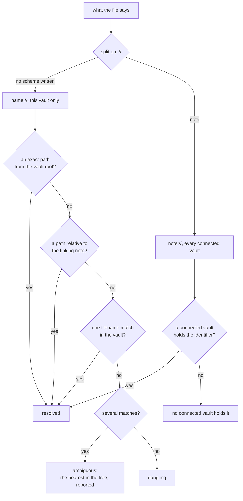

# Links

A link is one relationship as it was written in a file: what it points at, what kind of relationship it is, and what the person called it. Where it goes is a question asked of the index, not a fact stored in the file.

## The record

A link that carries a role is written in the `links:` block of the frontmatter — see [Note format](note-format.md).

| Field | Required | What it is |
| --- | --- | --- |
| `to` | yes | the address it points at |
| `role` | yes | what kind of relationship it is, from the closed list of five |
| `type` | no | what the link is for, as a feature reads it |
| `label` | no | the few words the person calls this relationship, drawn along the line between the two notes |
| `note` | no | why the link exists, in the person's words |

`label` and `type` answer different questions. A type is a category code reads; a label is the person's own words, read by nobody but them. A link may carry either, both or neither. No field carries a copy of the target's name.

```yaml
---
links:
  - to: "[[Thermodynamics]]"
    role: parent
  - to: "[[Linear algebra]]"
    role: parent
    type: requires
    note: "only eigenvectors are needed"
  - to: "[[Entropy as disorder]]"
    role: jump
    type: contradicts
    label: "argues the other way"
---

Ordinary text with an [[ordinary link]], which is a `ref`.
```

An entry with no `to`, an entry with no `role`, and an entry the application cannot read are each a problem against the note that wrote them; the rest of the note is read as usual.

## Roles

The list is closed. Navigation and rendering read it, so a role nobody decided on has no behaviour and is reported.

| | |
| --- | --- |
| `parent` | the note this one hangs under. |
| `child` | the note that hangs under this one. |
| `jump` | a shortcut across the hierarchy. |
| `ref` | a plain mention. It is the body `[[wikilink]]`, produced by the parser, and is never hand-authored in the block. A wikilink inside a code fence is an example of a link and not one. |
| `attachment` | something that is not a note. It takes no part in the hierarchy. |

`type` is an open vocabulary, and a value is introduced together with the code that reads it: one feature, one type. `preset` is one of them: written on a deck's link, it says which note schedules that deck — [Cards](cards.md).

## The hierarchy

`parent: B` written in A and `child: A` written in B are one edge, and either end may be written. A link is answered in both directions — what a note points at, and what points at it — so whichever end the person found convenient is the end that shows.

Multiple parents are ordinary: the hierarchy is a directed acyclic graph, not a tree.

`sibling` is not stored. Siblings are the children of a shared parent, which is a query.

## The same link written twice

`[[notes/Entropy]]` in the block and `[[Entropy]]` in the prose are one link. Sameness is decided by where the links resolve, so the fold happens after resolution. Two links that resolve to nothing are the same only when they were written the same.

The annotated record wins: a mention in the prose gives way to the entry that carries a role, a type and a note.

## Addresses

An address is scheme and value, and it is the only thing that says where a link goes.

A name in brackets is the primary written form: `[[Thermodynamics]]`. `note://<id>` is the auxiliary form, and it appears where it arises by itself — the application inserted the link and already knew the identifier, or the name was ambiguous and the priority below picked no one target. Two forms, and no third.

`name://` is the stored form and never appears in a file: the parser sees `[[Thermodynamics]]` and stores `name://Thermodynamics`, so every stored address carries a scheme and reading one is a split on `://`. A scheme is letters, digits, `+`, `-` and `.` written before the `://`, so the colon in a title like `Lecture 3: entropy` begins no scheme.

A name is stored exactly as written and compared without regard to case: `[[entropy]]` finds `Entropy.md`, and a rename puts back the form the person chose.

A note's extension may be written or left off, and every other dot belongs to the name: `[[Lecture 1.2]]` finds `Lecture 1.2.md`.

Inside the brackets, an alias after `|` is how the link is read in the sentence and a fragment after `#` names a place inside the note. Neither is part of the address, and both survive whatever happens to the target.

A filename carrying `#`, `|`, `://` or `]]`, or with a space at either end, cannot be written as an address that reaches it back: the character is read as punctuation of the link. Such a note is addressed by its identifier or not at all.

An `attachment` points at an address no note answers to — a file in the vault, or a URL — and nothing resolves it as a note.

## How a name resolves

In descending priority:

1. an exact path from the vault root;
2. a path relative to the folder of the note the link is written in;
3. a single filename match anywhere in the vault;
4. several matches — the link is **ambiguous**, not dangling. It resolves to the nearest match in the tree, measured by how much of the path it shares with the note the link was written in, and the ambiguity is reported.

Resolution is a query and is never stored: adding a file resolves a link that was dangling, and removing one breaks a link that worked.

A name resolves only inside the vault it was written in. Two vaults may each hold an `Entropy.md`, and neither is the other's answer. An identifier names one note in the world, so `note://…` resolves in whichever connected vault holds that note, and the vault it landed in travels with the answer. This is the one query that deliberately looks past the vault it was asked about.

An identifier no connected vault holds is a fourth state: not resolved, and not dangling. Nothing here can tell a note that was deleted from a note in a vault the person has not added, and it says so. There is no server, no federation and no fetching: a link into a vault the person has not added is text with a known shape.



## After a move or a rename

The application does this when the move happens inside it. A rename made outside, with the application closed, is not tracked and leaves names dangling.

What pointed at the note is read before the file moves, and each of those links is asked again afterwards.

- **`note://` links are untouched.** An identifier is not tied to a name.
- **A link that still reaches the note is left alone.** A name follows the note it names.
- **A link that now reaches nothing is written again**, pointed at the name the note is filed under now. Only the target part changes: the brackets, the alias, the fragment, the quoting and the spacing around it survive, and every other byte of the note is left as it was.
- **A link that now reaches a different note is reported and not repaired.** Which note was meant is the person's to settle.
- **A note whose frontmatter will not parse is not written.** Its link stays broken and shows as a problem.

Resolution is a query, so every other link in the vault answers to the new picture the next time it is asked. If there was one `Entropy.md` and now there are none, a link that pointed at it may quietly start reaching a same-named file elsewhere.

## What is reported

Four checks, each finding filed against the note somebody would open to settle it.

| | |
| --- | --- |
| `parse` | what reading one file turned up: a link with no target, a link with no role, a role nobody decided on, an identifier that is not one. |
| `frontmatter` | a block between the delimiters that is not YAML. The note is indexed anyway, and nothing may be written into it. |
| `ambiguous` | a link that reaches more than one note. It reaches the nearest, which is a fact about where the notes currently sit, so it changes meaning when either of them moves. |
| `dangling` | a link that reaches nothing. Writing the note it names is what mends it. |

`dangling` is quiet: it arrives only when it is asked for by name. The other three run whenever a vault is checked.
