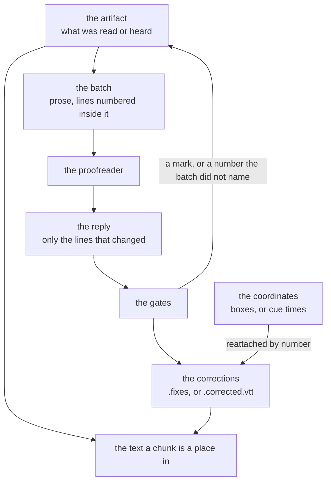

# Putting a text right

What a second model corrects in a text the first one produced, what it is shown, and what is done with its answer. A scan and a recording are proofread by the same mechanism: the model is given numbered lines, and answers with the same numbers. The corrections go beside the artifact, which is never rewritten.

## One mechanism, two texts

A machine that read a page and a machine that heard an hour both produce text nobody typed, and both get things wrong. What they got wrong is different — a scan carries letters the eye of a machine misread, speech carries words its ear misheard — and everything around that is the same, so one mechanism serves both.

| Proofread | The unit | Where the corrections go |
| --- | --- | --- |
| a reading | one printed line | `ocr/<hash>.fixes` |
| a transcript | one cue | `asr/<hash>.corrected.vtt` |

What a reading is and how its files hold together is [Reading](reading.md). What a transcript is and how a moment in it is named is [Transcribing](transcribing.md).

## The model is never shown a coordinate

A line carries a rectangle on a page. A cue carries two times on a clock. Neither is sent.

The model is given prose with the lines numbered inside it, and it must answer with those numbers. A number is a name, not a position: it says which line, and nothing about where that line stands. The coordinates are reattached afterwards from what was originally read or heard, by the number.

This is what makes a correction safe to apply. Putting a line's letters right leaves its words inside that line, so the rectangle it was read at and the times it was heard between hold unchanged. A reply that renames a line, or that moves a word from one line into another, has broken the one thing the coordinates depend on, and it is refused whole.



## What is asked

A batch is the lines run together as prose, each opened by its number:

```
⟦864⟧Kenduvilva is situated about twenty miles ⟦865⟧south of Siuri on the banks
of the Ajay River. ⟦866⟧In the Gaudiya Vaişnava Abhidhāna, it is …
```

`⟦n⟧` opens the line numbered `n`, and that line runs to the next mark. The lines are run together, so a line ending mid-word is finished by the next one and the model reads a sentence rather than a column of fragments.

The reply is only the lines that changed. A batch the proofreader would leave alone is an empty reply. A reply row is the line's number and, after it, the line, with a bar, spaces, or both standing between them:

```
866|In the Gauḍīya Vaiṣṇava Abhidhāna, it is
```

A row whose number runs into a word is not a row. Where no bar tells the two apart and the line as read opens with the digits the row opens with, the row's number was left out and the batch is refused.

## What a transcript says it holds

A batch is forty lines of an hour, and a name or a term the rest of the recording establishes is, inside those forty lines, a word with no support. It reads as a mishearing and comes back an ordinary word, differently in each batch.

So a transcript's batches carry a digest of the whole of it, standing before the first mark:

```
The speech opens: welcome everyone today we will read a verse that the teacher …

Words recurring through it, as the machine heard them: Kenduvilva, Gaudiya, Ajay
```

It is drawn from the transcript and from nothing else — the opening words as they were heard, and the words standing capitalised somewhere other than where a sentence opens, said more than once. A recording of any subject is described in the terms it uses itself, and no coordinate, path or name from the vault is in it. The model is told the digest is read and answered for by nothing, and that a word listed there is put right the same way every time it is said.

A reading carries no digest: a page of a book is proofread against the page.

## The gates

None of them asks whether a correction is right.

- **A mark of ours coming back refuses the batch.** No recogniser and no transcriber produces `⟦` or `⟧`, and either of them anywhere in a reply refuses the whole batch.
- **A line number the batch did not name refuses the batch.**
- **A line two rows both answer for refuses the batch.** A line stands in one answer, so the words of a line are in that answer and in no other.
- **Letters that moved further than `max_edit_distance` drop that one correction.** Spaces, punctuation, symbols, diacritics and case come off both sides, and the Levenshtein distance between what is left is taken as a share of the longer. 0.30 where the file names nothing.

Two more corrections are dropped without refusing the batch: one saying what the line already says, and one that only puts something wordless in front of what the line already says.

A refused batch is left as it was read or heard. So is a batch nothing came back about. That is the ordinary outcome and not a failure.

## The two instructions

The model is told which kind of text it has, because a scan and speech are corrected for different mistakes.

A scan is corrected for what a machine misread off paper: letters, diacritics, words run together or broken apart, marks that are not words. Nothing is translated, rephrased, repunctuated or improved, and a line read correctly is left alone.

A transcript is corrected for what a machine misheard: a word for its homophone, a name spelled as it sounded, a sentence ended in the wrong place, the punctuation a model that hears has no way to place. The words a person actually said are not rewritten into better ones, and a stretch heard correctly is left alone.

Both instructions carry the same rules about the answer: a line is answered for once, nothing is added that the page does not print or the recording does not say, the marks are never written back, and a line to leave alone is a line not answered with.

A printed line holds its words: on a page they stay where they were printed. Speech runs on past the stretch it was cut into, so a transcript is also answered for in runs, written as the first line of the run and the last: `12-14|the whole sentence, put right`. The lines of a run become one cue, spanning the moments they were spoken between. A line where one sentence ends and the next begins stands in the run of both, and that run is answered with every sentence it covers.

## Profiles

A profile is a way of reaching a proofreader, under a name. `indexing.proofreading.profiles` is a map of name to profile, and each consumer names the profile it uses.

A profile is flat: `use`, the keys of both stations and the two sizes all sit at the profile's own level. `use` says which of them apply, and a key it does not apply to is ignored.

`use` is one of two:

- **`service`** — anything speaking the `/v1/chat/completions` request shape, named by `base_url`, with `name` for the model and `key` or `key_env` for the key. OpenRouter where the file names nothing. `batch_url` is the queue batches are left in and collected later, at half the price. A batch outlives the run that left it, so one left before the application closed is collected when it opens. Empty asks a batch at a time and waits.
- **`agent`** — the `claude` command line the person already has installed, run as a plain one-shot process. No MCP servers, no tools: it is given text and answers with text, and it cannot write anything. `model` says which of its models answers, and `command` names the command line to run where it is not `claude` from the path. There is no queue, so a batch is asked and waited for.

A profile carries `batch_size` — how many lines one request carries — and `overlap` — how many lines neighbouring batches share. Overlap is what keeps a phrase torn at a batch boundary whole for at least one of the batches that see it. A line two batches both answered about is taken from the later of the two, which is the batch that saw more of what follows the line.

It also carries `in_flight`: how many batches are being asked about at any moment. What a batch costs is what the model writes back rather than what it took to ask, so a run is as long as its batches are asked one after another. At the command line this is a person's own model, and it is left most of itself while they are using it.

`indexing.proofreading.max_edit_distance` stands above the profiles. It is the Levenshtein distance between two lines' letters as a share of the longer of them, and a correction standing further than that from the line as read is dropped. It is one threshold for the installation: how far a correction may move a line's letters says nothing about what the correction was asked for through. It is 0.30 because the measured distribution has a hole there — over 931 corrections of one book, every correction standing further apart than 0.30 was damage, and every one below it was a correction. It is a setting because the next book is not that book; the figures are in [Performance](performance.md).

Every key is in [Settings](settings.md).

## Who proofreads, and whether it runs by itself

Each consumer names its profile and says whether it runs on its own:

```json
{
  "indexing": {
    "recognition":   { "proofread": { "with": "openrouter", "automatically": true } },
    "transcription": { "proofread": { "with": "agent",      "automatically": true } }
  }
}
```

`automatically` false leaves proofreading to the hand: a person asks for it on the text in front of them.

`indexing.transcribe_recordings` is a different flag, and the two are easily taken for one another. It says whether a recording nobody asked about is listened to at all; `transcription.proofread.automatically` says whether a transcript that already exists is put right by itself.

A `with` naming a profile the map does not carry is an error at startup. An installation that meant to proofread and misspelled the name is told so, and does not run for a week quietly proofreading nothing.

## A run

A run claims the text for as long as the proofreading takes, and a second run against the same text reports that somebody else has it.

After each batch a run writes the corrections, cuts the source again, and writes the count last. The count is what makes the batch before it count, so a batch no count claims is one the next run asks about again, and a run trims the corrections back to the count before it starts. A run stopped part way is taken up where it stopped. A text whose record names another proofreader is taken up from the beginning, with what that proofreader wrote taken away.

One model proofreads, and no chain of them. A chunk whose text did not change keeps the vector already made for it.

Neither artifact is rewritten: what the model read or heard stays on disk under its own name, and the corrections go beside it. What a reading's corrections are kept in and how a corrected reading is composed is [Reading](reading.md); what a transcript's are kept in is [Transcribing](transcribing.md).

## What a person sees

In the recording tab the transcript is text, in the same editor a note is written in. One line a cue, the cue's timestamp in the gutter beside it. A person puts a name right the way they would put a word right in a note.

It is read-only while the recording is still being listened to and while proofreading is running. The words are moving underneath, and what a person typed into a line a run is about to rewrite would be lost. When both are done, the text is editable and a save writes `.corrected.vtt`.

A **follow** toggle says whether the view moves with the recording. On, the line being said is scrolled to as the player reaches it. Off, the view stays where the person put it and they read one part of a talk while another plays. The line being said is highlighted either way, so the position is visible without the page moving.

## Settings

Every key named above lives in [Settings](settings.md): `indexing.proofreading.max_edit_distance`, and under `indexing.proofreading.profiles.<name>`, `use`, `batch_size`, `overlap`, `in_flight`, `base_url`, `batch_url`, `name`, `key`, `key_env`, `command` and `model`, with `indexing.recognition.proofread` and `indexing.transcription.proofread` naming one of those profiles under `with` and saying `automatically`.
