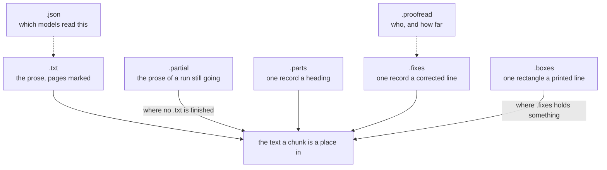

# How a book is read

What a machine reads off the pages of a scanned document, where it is kept, and what is done to it afterwards. A reading is written into the vault's own folder, under `.numen/ocr/`, and the source is cut from it (see [A book's text is a cache or an artifact](adr/0015-a-books-text-is-a-cache-or-an-artifact.md)).

## The files of one reading

A reading is named by the hash of the bytes it was made from. A document renamed or moved keeps its reading, and two copies of one document in a vault share one. Seven names are composed from the producer and that hash:

| Name | What it holds |
| --- | --- |
| `<hash>.txt` | the prose, with the pages marked in it |
| `<hash>.partial` | the prose of a run still going, and how far it has got |
| `<hash>.boxes` | one record a printed line: its page, its run of bytes in the prose, and its rectangle as a fraction of that page |
| `<hash>.parts` | one record a heading: where it begins in the prose, how far it runs, and how deep it sits |
| `<hash>.fixes` | one record a corrected line |
| `<hash>.proofread` | who proofread the reading, how far they got, and the batch that is out |
| `<hash>.json` | which models read the document, at what resolution, and under which recipe |

One run made them and none of them means anything without the others.

Four compose into the text a chunk is a place in: the artifact — or the partial, where no artifact is finished — with the parts, the corrections, and the boxes the corrections are keyed by. The other two are read by a person asking what produced a text, and by a sweep looking for everything a recogniser now known to be bad wrote.

## What the artifact holds

Plain text. Each page opens with a pair of form feeds and the newline closing them, and the page's prose follows, one blank line between the regions the layout model found. A recogniser has no character for a form feed, so nothing in the prose is escaped.

The marks are taken out when the artifact is read. An offset in what comes back is an offset in the prose, and a chunk cut from it holds what the page says. Text standing before the first mark belongs to no page and is kept.

A page with nothing on it is written, and its mark is what makes the page after it findable. A document with nothing on it writes nothing at all, and the source goes back on its own text layer.

A partial is the source's text while it is being written. After every batch the source is cut again from what has been read, so a book answers about the pages already read while the rest is still being read; while a run is on, the part of the book beyond the count is out of search. Reading a text back tries the finished artifact and then the partial.

## How a page is named

A page is called by its position in the file, and the pane a person reads it in opens at that number. The marks are written one per page in order, so the number is the position and is stored nowhere.

What the paper printed is not kept. The page-label dictionary a born-digital PDF may carry is not read, and the region the layout model calls a page's number is not among the regions that carry what the document says.

An EPUB is the exception. A book made for a screen has no pages of its own, so the page breaks it names from the printed edition it was set from are the only page names it has, and a page of one is called by its label.

## Parts

A reading names its parts. The layout model names the headings, and one record a heading goes into `.parts`: where the heading begins in the prose, how far it runs, and how deep it sits, counted from zero with a document title above the section titles within it.

Parts are built from that sidecar, so a recognised document names them as a book with an outline does. A part is named by the run of prose its heading occupies, read as the scan was read. Structure is kept, and never inferred from the recognised words.

A parts sidecar whose records run backwards, or reach past the end of the prose, was written for other bytes. None of it is used and the reading is located by its pages alone.

The boundary the line detector draws falls inside the letters, so a found line is widened before it is read, by `indexing.recognition.detect.expand` pixels of the image the detector reads — eighteen where the file names nothing. One number serves a heading and a paragraph, because a part is read scaled so that its longest side is a fixed length. See [Settings](settings.md).

## Proofreading

A page was printed before it was scanned, so there is something to put the reading right against: what the paper says. The proofreader is asked for the letters, diacritics, and words run together or broken apart that the recogniser got wrong, and for nothing else — a line read correctly is not translated, rephrased, repunctuated or improved.

How a proofreader is asked, what its reply must look like, what refuses one and which profiles are available is [Proofreading](proofreading.md). Nothing is proofread unless `indexing.recognition.proofread` names one, and naming none means a reading is used exactly as it was read.

The unit of correction is one printed line. A record in `.boxes` is one run of words the recogniser read in one go, and it carries a rectangle; putting a line's letters right leaves its words within that line, so the rectangles hold unchanged. A line is known by where its box stands in the reading, so the number a correction is keyed by counts through the whole book.

The recogniser's artifact is never rewritten. It stays on disk under its own name, the corrections go beside it in `.fixes`, and `.proofread` says who put the reading right, how far they got, and which batch is out.

## Applying corrections

Composing the corrected prose and moving the boxes, the page marks and the parts is one pass over the same lines. The prose is spliced where each corrected line stands, and the growth carried along that walk is what the rest is read off. A correction naming a line no box answers to is dropped, a line named twice keeps what came last, and a box reaching back into the one before it is left as it was.

A run stopped part way is taken up at the page it stopped on. A reading whose `.proofread` names another model is taken up from the first page, with what that model wrote taken away.

The recipe names the layout model, the recogniser, the resolution and the producer. It does not name the proofreader: a recipe names a procedure, and proofreading calls the cut itself, the way recognition does.

## A run

Recognition resumes the way proofreading does: pages are appended to the partial in batches — sixteen at a time — and the count is appended after them, on a line beginning with a byte no recogniser can write, which the artifact's own reader passes over. The count is what makes the batch before it count, so a batch no count claims is one the next run reads again.

A run claims the reading for as long as it takes, and a second run against the same reading reports that somebody else has it.

A chunk whose text did not change keeps the vector already made for it.

## Settings

Every key named above lives in [Settings](settings.md): `indexing.recognition.detect.expand`, and `indexing.recognition.proofread.with` and `.automatically`. The profile that `with` names, and the threshold above the profiles, are in [Proofreading](proofreading.md).
