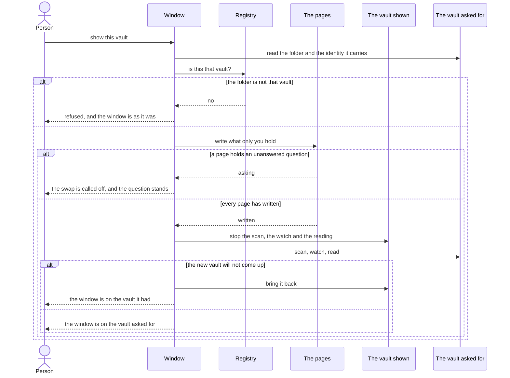

# Several vaults, one window

An installation holds a list of vaults. The window shows one of them at a time, and moving to another happens in the window that is already open. This page is that list — what is on it, what may go on it, what takes something off it — and what happens in the moment one vault is put down and another taken up.

## One installation, one vault at a time

The process holds two halves, and they have different lifetimes.

**The installation is made once**: the index, the embedder, the list of what is being done, and everyone listening to it. **One vault is made and unmade**: the scan, the watch, the reading of documents, the documents held open, and what each of those has in flight.

Opening another vault unmakes the second half and makes it again. One database holds every vault and the embedder is the installation's, so neither is touched. See [ADR-0004](adr/0004-a-hexagonal-core-in-go.md).

## A swap settles first

Every page writes what only it holds before anything is taken away. This is the settling a window closing does, asked for a second reason — see [ADR-0020](adr/0020-one-process-one-lifetime.md).

**A page holding text a person has to answer for calls the swap off.** The window stays on the vault it had, and the question stands. A page that says nothing has three seconds to hand over what it holds.

**One settling runs at a time.** A swap and a close each ask for one, and the second to arrive is refused in words. A close asked for during a swap is refused and is not asked again; the person presses close a second time.

## Nothing is taken down before the new vault is verified

The folder asked for is opened and the identity it carries is held against the registry, before the settling and before anything is unmade. A vault that fails that is refused with the window exactly as it was.

**A vault that fails to come up after the old one is gone brings the old one back.** Where that also fails, the window stands on nothing, says so, and keeps the door on writes shut.

Everything a page was holding was read in a vault that is no longer in front of it, so the pages are told to load again.

## The registry is the list

Which vaults exist, where they are and which was opened last is JSON, written by the application, kept where the application keeps its own files and beside `numen.json` — see [Settings](settings.md). It is not derivable from anything and it is not a cache. It is read before the database opens, and most of all when the database will not open. See [ADR-0002](adr/0002-one-database-for-all-vaults.md).

The `vaults` table in the index is what every other row's foreign key points at. It is a copy of the list, which a scan writes again.

## What may go on the list

**A vault has a unique name.** A folder added under a name another vault has gets the lowest free number appended, and the person renames it afterwards. Renaming a vault to a name another one has is refused. Two names are one name when they are equal ignoring case and composed the same way.

**Vault roots do not overlap.** A root that lies inside a registered vault, or that holds one, is refused. One file lies under one identity.

**A filesystem root is not a vault, and neither is the person's home directory itself.** A path that is not absolute is refused, and so is a folder that cannot be read as a vault.

### An identity already on the list

A vault carries its identity inside its own folder, so it is recognised wherever that folder moves to. An identity already registered at another path is either a move or a copy, and the two are told apart by looking:

- **the old path still carries that identity** — both folders exist, and this is a copy. It is refused, naming both paths and the identity. One index holds one of them. The remedy is the person's: delete the service folder from the copy and add it again, and it becomes a vault in its own right.
- **the old path is gone, or no longer carries that identity** — the folder moved, and the registry is what catches up. The entry is written at the new path, and the vault keeps the name it had.

## Taking a vault away

**Forgetting** takes a vault off the list and out of the index. The folder stays where it is with the identity it carries, and adding it again brings back the same vault.

**Erasing** forgets it and puts the folder in the place this machine keeps what a person deleted. The folder is the person's own writing, so it goes where deleted things go and comes back from there. A machine with nowhere to put it refuses and says so, and a folder that no longer carries this vault's identity stays where it is. A path with nothing at it any more is forgotten and nothing is moved.

**Neither may take the vault the window is showing, and neither may take the last vault an installation has.** The window always stands on something. The use cases are not told which vault is in front of the person; the window is what knows, and what refuses.

### What forgetting does to the index

Nothing cascades into a virtual table, so the five are emptied by hand before the row the cascade hangs off is deleted: the vector index, and the four full-text indexes over chunks, part names, titles and headings. The vector index carries the vault as a column of its own; the other four are addressed by numbers read from the tables the last statement takes away.

**The vectors stay.** A vector is addressed by the text it was made from, so chunks of several vaults hold one vector, and a vault that goes takes none of them with it.

The index file does not shrink. The space is reused and the file is the size it was.

## What an agent may do

Five tools, from [ADR-0021](adr/0021-an-agent-reaches-the-vault-through-tools.md):

| Tool | What it does |
| --- | --- |
| `vault_list` | every vault this installation holds, and which one the person is looking at. A vault whose folder is gone is marked and stays on the list. |
| `vault_add` | put a folder on the list. With no path, this machine's own picker goes up in front of the person and what they choose is added; a person who closes it has chosen nothing, and the answer says so. With a path, the folder at that path becomes a vault. Nothing already in the folder is moved or rewritten, and the vault's identity is written into it. |
| `vault_rename` | call a vault something else. |
| `vault_forget` | take a vault off the list and out of the index. |
| `vault_open` | put another vault in front of the person. The agent's session ends with the vault it was serving. |

Every other tool works the vault marked `showing`, and no other.

**There is no tool that erases a vault from disk.** Taking a person's folder away is asked for in front of them.

`vault_add` with a path followed by `vault_open` lets an agent name the folder it then works inside.

## What is not covered

- **On Windows a folder can be deleted outright.** Where the volume has no recycle bin, the shell deletes permanently and reports success, and no flag turns that into a refusal. "It goes to the trash and comes back" is honest on Linux and is not on Windows.
- **The macOS trash is unverified.** It compiles and has never run: the selectors, the boolean return and the error out-parameter are untested until somebody runs it on a Mac.
- **`vault_open` answers before the swap happens.** The endpoint the answer travels over is what the swap closes, so the call cannot wait for it. Whether the answer arrives before the transport goes is a race, and the tool says so.
- **The registry is not locked between processes.** Each write rewrites the whole file, so a window and a command line writing at once lose one of the two entirely. Inside one process it is locked.
- **A failed reading left in the list of what is being done survives a swap.** A cancelled one takes itself out; one that failed stays until it is dismissed, and it outlives the vault it was about.
